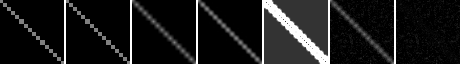
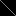
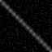
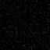

# Model D Shape Benchmark: diagonal

## Question

Model Dは `diagonal` の16x16 low-resolution guideから、64x64出力で境界または階調を妥当に扱えるか。

## Hypothesis

hard edge shapeではconfidence mapとedge-aware interactionにより、bilinear/bicubic baselineと同程度以上に境界を保つ可能性がある。soft gradientではedge leakageではなく、列平均の逆行や急な段差が少ないことを確認する。

## Setup

- Command: `$env:PYTHONPATH = "src"; .\.venv\Scripts\python.exe experiments/exp_005_model_d_shape_benchmark.py`
- Date: 2026-05-16
- Shape: diagonal
- Experiment seed: 20260516
- Decoder seed: 5300
- Low guide size: 16x16
- Output size: 64x64
- Model: Model D candidate
- Model config: `{'j_base': 1.8, 'lambda_data': 6.0, 'gamma': 35.0, 'texture_weight': 0.35}`
- Decode config: `{'sweeps': 35, 'temp_start': 0.35, 'temp_end': 0.01, 'proposal_sigma': 0.08}`
- Python / dependency version: Python 3.12.13, NumPy 2.3.5

## Baseline

baselineはnearest、bilinear、bicubicの3種類のlow-resolution guide upscalingとした。metricsのreferenceは同じsynthetic shapeを64x64で生成した比較用参照であり、実画像のGround Truthではない。

## Result

| Output | MAD vs synthetic reference | Edge leakage | Edge width pixels | Foreground mean | Background mean |
| --- | ---: | ---: | ---: | ---: | ---: |
| nearest | 0.022461 | 0.008403 | 0.000000 | 0.293578 | 0.000546 |
| bilinear | 0.030566 | 0.069399 | 3.262295 | 0.255716 | 0.005106 |
| bicubic | 0.024482 | 0.050275 | 2.573770 | 0.298864 | 0.003438 |
| model_d | 0.044796 | 0.073768 | 3.540984 | 0.245277 | 0.019788 |

Decode time seconds: 1.833956

Mask note: foreground is the non-zero region in the clean high-resolution synthetic reference.

## Images

## Interpretation

この結果はsynthetic guide上の比較であり、Model Dの一般的な超解像性能を示すものではない。hard edge shapeではedge leakageとedge width、soft gradientでは階調の連続性メモを中心に読む。

## Limitations

- 比較用referenceはsyntheticに生成した高解像度shapeであり、実画像のGround Truthではない。
- Model D候補はPython/NumPy実装で、環境非依存のbit-perfect再現性は未確認。
- texture termは白色ノイズに近く、意味的ディテールや自然な質感を生成するものではない。
- decode timeはこの環境の小画像runに限る。

## Next

- Issue #6 でcrossを含むbilinear/bicubic比較指標との整合を確認する。
- Issue #14 でguided filter / guided upsamplingとの位置づけを調査する。
