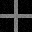
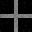

# Model C Cross Baseline

## Question

同解像度のcross guideで、Model Cのdata fidelityとedge-aware interactionは、noisy static guide direct displayに対して暗部保持とエッジ漏れ抑制を示せるか。

## Hypothesis

Model Cは、guideへの忠実度を保ちながら近傍相互作用を使うため、crossの明部を保ちつつ背景への漏れを抑える。

## Setup

- Command: `$env:PYTHONPATH = "src"; python experiments/exp_002_model_c_cross.py`
- Date: 2026-05-16
- Experiment seed: 20260516
- Decoder seed: 42
- Input guide: synthetic cross with deterministic Gaussian noise
- Input size: 32x32
- Output size: 32x32
- Model: Model C
- Model config: `{'j_base': 2.0, 'lambda_data': 5.0, 'gamma': 40.0}`
- Anneal config: `{'sweeps': 80, 'temp_start': 0.5, 'temp_end': 0.01, 'proposal_sigma': 0.12}`
- Python / dependency version: Python 3.12.13, NumPy 2.3.5

## Baseline

baselineは、noiseを加えたstatic guideをそのまま表示する `baseline_direct.png` とした。Model Aは現時点で共通モジュールとして実装されていないため、このIssueでは `if implemented` の対象外として扱った。

## Metrics

| Metric | Baseline direct | Model C |
| --- | ---: | ---: |
| MAD vs clean guide | 0.015025 | 0.011684 |
| Cross mean | 0.496115 | 0.496849 |
| Background mean | 0.012604 | 0.007409 |
| Edge leakage | 0.012088 | 0.008887 |
| Cross variance | 0.000845 | 0.000997 |
| Background variance | 0.000305 | 0.000221 |
| Decode time seconds | 0.000000 | 0.621025 |

## Saved Artifacts

- Config: `config.json`
- Metrics: `metrics.json`
- Notes: `notes.md`
- Clean guide image: `guide_clean.png`
- Static guide image: `static_guide.png`
- Baseline image: `baseline_direct.png`
- Rendered image: `rendered_model_c.png`
- Difference image: `diff_model_c_vs_baseline.png`
- Comparison image: `comparison.png`

## Images

### Comparison

### Clean Guide

### Static Guide

### Baseline Direct

### Model C Rendered

### Difference

## Result

Model CのMAD、background mean、edge leakageを保存した。cross baselineの暫定目安である `Background Mean <= 0.02`、`Edge Leakage <= 0.02`、`MAD <= 0.03` と比較できる形式になった。

## Interpretation

この結果は、Model Cが少なくとも単一のsynthetic cross条件で、guideに近い値へ収束しながら背景を暗く保つ候補であることを示す。ただし、これは実用圧縮性能や超解像性能を示すものではない。

## Limitations

- 対象は単一のsynthetic crossのみで、斜線、円、細線、soft gradientでは未確認。
- Ground Truth比較はclean synthetic guideに限られる。
- Model A baselineは共通実装がないため今回保存していない。
- NumPy実装の同一環境再現性を確認した段階であり、Rust固定小数点や環境非依存のbit-perfect再現性は未確認。

## Next

- Issue #5 で複数形状のModel C freeze benchmarkを作る。
- Model Aを比較対象として残す必要があるか検討する。
- Rust移植前にPRNG、丸め、固定小数点の再現性要件を整理する。
