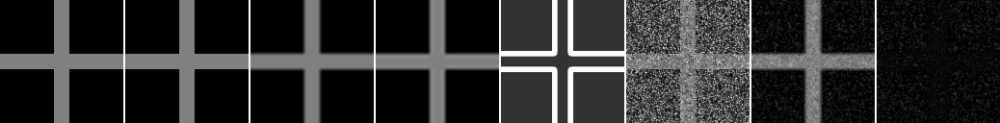
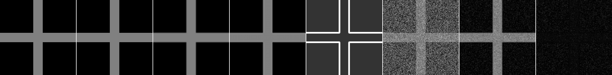

# Model C/D Decode Time Scaling Benchmark

## Question

Model C/Model D の Python decode time は、画像サイズに対してどの程度伸びるか。

## Hypothesis

現行のMetropolis型updateは各sweepで全画素を走査するため、decode timeはおおむね画素数とsweep数に比例して増える。32x32や64x64の小画像結果だけでは、128x128以上の実用性は判断できない。

## Setup

- Command: `$env:PYTHONPATH = "src"; .\.venv\Scripts\python.exe experiments/exp_006_decode_time_scaling.py`
- Date: 2026-05-17
- Experiment seed: 20260517
- Decoder seed base: 6100
- Output sizes: [32, 64, 128, 256]
- Sweeps: 12
- Shape: synthetic cross
- Model C config: `{'j_base': 2.0, 'lambda_data': 5.0, 'gamma': 40.0}`
- Model D config: `{'j_base': 1.8, 'lambda_data': 6.0, 'gamma': 35.0, 'texture_weight': 0.35}`
- Python / dependency version: Python 3.12.13, NumPy 2.3.5

## Baseline

baseline timingはnearest、bilinear、bicubic upscalingとした。Model Dはbilinear guide、gradient confidence、seeded texture termを使う。すべて同じsynthetic high-resolution crossをcomparison referenceとしてmetricsを計算する。

## Result

| Size | Nearest seconds | Bilinear seconds | Bicubic seconds | Model C decode seconds | Model D decode seconds |
| --- | ---: | ---: | ---: | ---: | ---: |
| 32x32 | 0.000118 | 0.000102 | 0.023236 | 0.083002 | 0.151503 |
| 64x64 | 0.000070 | 0.000150 | 0.094200 | 0.349256 | 0.567295 |
| 128x128 | 0.000111 | 0.000393 | 0.378947 | 1.370382 | 2.346793 |
| 256x256 | 0.000355 | 0.001720 | 1.506551 | 5.681323 | 9.440851 |

| Size | Model C MAD | Model D MAD | Model C edge leakage | Model D edge leakage |
| --- | ---: | ---: | ---: | ---: |
| 32x32 | 0.250299 | 0.134117 | 0.291417 | 0.225167 |
| 64x64 | 0.254651 | 0.058258 | 0.331011 | 0.165805 |
| 128x128 | 0.253728 | 0.047163 | 0.318396 | 0.156160 |
| 256x256 | 0.253817 | 0.042344 | 0.312915 | 0.153657 |

## Saved Artifacts

- Config: `config.json`
- Metrics: `metrics.json`
- Per-size metrics: `<size>x<size>/metrics.json`
- Per-size PNGs: `high_reference.png`, `low_guide.png`, `nearest.png`, `bilinear.png`, `bicubic.png`, `confidence.png`, `rendered_model_c.png`, `rendered_model_d.png`, `diff_model_d_vs_bilinear.png`, `comparison.png`

## Images

各sizeの `comparison.png` に、reference、baselines、confidence、Model C、Model D、differenceを横並びで保存した。

## Interpretation

decode timeはこのPython実装と実行環境に依存する。今回の結果は、現時点の制限を測るためのbaselineであり、実用圧縮形式としての性能を示すものではない。

## Limitations

- synthetic crossのみで、自然画像や複雑なtextureでは未確認。
- sweepsを12に固定したため、過去の80 sweeps実験と品質を直接比較しない。
- 256x256は短時間benchmarkとして実行しただけで、収束性や品質の十分性は評価していない。
- Rust実装、固定小数点、並列化、より効率的なupdate scheduleは未評価。

## Next

- 収束品質とdecode timeのtrade-offをsweep数別に見る。
- Model Dのtexture term ablationをIssue #37で確認する。
- 自然画像Ground Truthでの評価をIssue #36で扱う。
