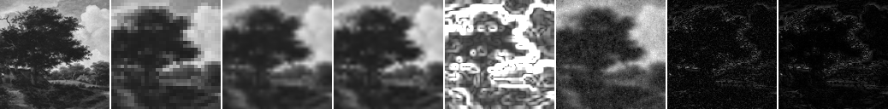
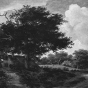
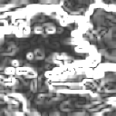
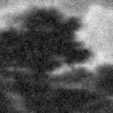
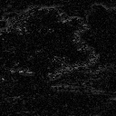

# Model D Natural Patch GT Evaluation

## Question

Public Domain の自然画像patchをGround Truthとして、32x32 low-resolution guideから128x128 outputを作るとき、Model D candidate は nearest / bilinear / bicubic baseline と比べてどの指標を改善または悪化させるか。

## Hypothesis

Model D は confidence map と edge-aware interaction により、強い勾配付近を補間baselineより保つ可能性がある。一方で、現行のwhite-noise texture termは自然画像のGround Truth差分や輝度biasを悪化させる可能性がある。

## Setup

- Command: `$env:PYTHONPATH = "src"; .\.venv\Scripts\python.exe experiments/exp_008_model_d_natural_patch.py`
- Date: 2026-05-17
- Experiment seed: 20260517
- Decoder seed: 6300
- Ground Truth size: 128x128
- Low guide size: 32x32
- Low guide generation: 4x4 block average from the 128x128 Ground Truth crop
- Source asset: `experiments/assets/landscape_pd_128.npy`
- Source page: https://commons.wikimedia.org/wiki/File:Landscape.jpg
- License note: Wikimedia Commons marks the faithful reproduction of this public-domain artwork as Public Domain / PD-Art.
- Model: Model D candidate
- Model config: `{'j_base': 1.8, 'lambda_data': 6.0, 'gamma': 35.0, 'texture_weight': 0.35}`
- Decode config: `{'sweeps': 18, 'temp_start': 0.35, 'temp_end': 0.01, 'proposal_sigma': 0.08}`
- Python / dependency version: Python 3.12.13, NumPy 2.3.5

## Baseline

baselineは、low guideを128x128へ戻す nearest、bilinear、bicubic upscaling とした。Ground Truth は同じ自然画像cropの128x128 grayscale画像であり、low guideはそのblock-average縮小から作った。

## Result

| Output | MAD vs GT | PSNR vs GT | Global SSIM vs GT | Gradient MAD | Strong-edge MAD | Mean error | Time seconds |
| --- | ---: | ---: | ---: | ---: | ---: | ---: | ---: |
| nearest | 0.045384 | 22.578 | 0.953421 | 0.092455 | 0.089966 | -0.004017 | 0.000214 |
| bilinear | 0.044369 | 23.276 | 0.959480 | 0.094319 | 0.082830 | -0.003177 | 0.000466 |
| bicubic | 0.042397 | 23.578 | 0.962820 | 0.090419 | 0.081152 | -0.003131 | 0.380279 |
| model_d | 0.055577 | 22.238 | 0.948710 | 0.159078 | 0.087517 | -0.002693 | 3.585827 |

## Saved Artifacts

- Config: `config.json`
- Metrics: `metrics.json`
- Ground Truth image: `high_reference.png`
- Low guide image: `low_guide.png`
- Baseline images: `nearest.png`, `bilinear.png`, `bicubic.png`
- Confidence map: `confidence.png`
- Model D rendered image: `rendered_model_d.png`
- Difference maps: `diff_model_d_vs_bilinear.png`, `diff_model_d_vs_gt.png`, `diff_bilinear_vs_gt.png`
- Comparison strip: `comparison.png`

## Images

## Interpretation

この結果は1枚の小さなpublic-domain画像cropに対する最小評価であり、super-resolutionやcompressionの成立を示すものではない。Model Dの評価は、Ground Truth差分、勾配差分、強エッジ帯の差分、輝度biasをbaselineと分けて読む。

今回のrunでは、Model D が nearest / bilinear / bicubic に対して総合的に改善したとは解釈しない。white-noise texture termと現在の重みが、自然画像GTとの差分をどの程度増やすかを見るための初期測定として扱う。

## Limitations

- サンプルは1枚の128x128 cropのみ。
- 元画像は絵画の写真であり、カメラ撮影の自然風景や標準画像データセット全体を代表しない。
- Global SSIM は依存なしの全画像SSIMであり、windowed SSIMではない。
- edge leakage は自然画像の明確なforeground/background境界ではないため使っていない。代替としてgradient MADとstrong-edge MADを保存した。
- decode timeはこの環境の小画像runに限る。

## Next

- texture term の寄与は Issue #37 のablationで分離する。
- 画像サンプル数を増やす場合は、ライセンス、crop位置、low guide生成手順を固定する。
- Model Dの重み再調整やtexture prior候補は、Issue #15 と接続して検討する。
