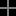
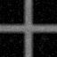
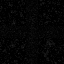

# Model D Cross Baseline Comparison

## Question

Model D は cross の low-resolution guide から 64x64 output を生成するとき、nearest / bilinear / bicubic と比べて何を改善し、何を悪化させるか。

## Hypothesis

Model D は confidence map と edge-aware interaction により、bilinear より境界付近の拘束を強める可能性がある。一方で、white-noise texture term は synthetic reference とのMADや背景漏れを悪化させる可能性がある。

## Setup

- Command: `$env:PYTHONPATH = "src"; .\.venv\Scripts\python.exe experiments/exp_007_model_d_cross_comparison.py`
- Date: 2026-05-17
- Experiment seed: 20260517
- Decoder seed: 6200
- Low guide size: 16x16
- Output size: 64x64
- Shape: synthetic cross
- Model: Model D candidate
- Model config: `{'j_base': 1.8, 'lambda_data': 6.0, 'gamma': 35.0, 'texture_weight': 0.35}`
- Decode config: `{'sweeps': 35, 'temp_start': 0.35, 'temp_end': 0.01, 'proposal_sigma': 0.08}`
- Python / dependency version: Python 3.12.13, NumPy 2.3.5

## Baseline

baselineは nearest、bilinear、bicubic upscaling。metricsのreferenceは同じsynthetic crossを64x64で生成した比較用参照であり、実画像のGround Truthではない。

## Result

| Output | MAD vs synthetic reference | Edge leakage | Edge width pixels | Foreground mean | Background mean | Time seconds |
| --- | ---: | ---: | ---: | ---: | ---: | ---: |
| nearest | 0.013794 | 0.128409 | 0.000000 | 0.500000 | 0.017390 | 0.000150 |
| bilinear | 0.033143 | 0.219728 | 2.877193 | 0.465766 | 0.032859 | 0.000167 |
| bicubic | 0.035119 | 0.211894 | 1.964912 | 0.496146 | 0.030929 | 0.096157 |
| model_d | 0.047106 | 0.220617 | 2.745614 | 0.460225 | 0.046413 | 1.740974 |

## Saved Artifacts

- Config: `config.json`
- Metrics: `metrics.json`
- Low guide image: `low_guide.png`
- Synthetic comparison reference: `high_reference.png`
- Baseline images: `nearest.png`, `bilinear.png`, `bicubic.png`
- Confidence map: `confidence.png`
- Model D rendered image: `rendered_model_d.png`
- Difference maps: `diff_model_d_vs_nearest.png`, `diff_model_d_vs_bilinear.png`, `diff_model_d_vs_bicubic.png`
- Comparison strip: `comparison.png`

## Images

## Interpretation

この結果は synthetic cross 上の比較であり、Model D の一般的な超解像性能を示すものではない。Model D が単純補間より優れているかは、MAD、edge leakage、edge width、背景平均、差分画像を分けて読む必要がある。

今回のrunでは、Model D は MAD、edge leakage、background mean で nearest / bilinear / bicubic を改善しなかった。edge width は bilinear よりわずかに小さいが、MADと背景漏れの悪化を伴うため、総合的な改善とは解釈しない。

## Limitations

- 実画像のGround Truth比較ではない。
- synthetic cross は Model D に有利または不利な単純条件であり、自然画像の復元性能は評価していない。
- white-noise texture term は意味的ディテールではない。
- decode timeはこの環境の小画像runに限る。

## Next

- 自然画像Ground Truthでの評価は Issue #36 で扱う。
- texture term の寄与は Issue #37 で ablation として確認する。
- guided filter / guided upsampling との位置づけは Issue #14 で整理する。
