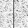
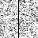
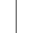

# Model C と Perona-Malik 型 diffusion の最小比較

## Question

Model C の guide 差分ベース edge-aware weighting と、Perona-Malik 型の画像勾配ベース diffusion は、同じ synthetic vertical edge で係数決定元と出力の読み方がどう違うか。

## Hypothesis

Model C の近傍重みは guide `s` から固定的に決まり、decoder state のノイズには直接追従しない。一方、Perona-Malik 型 diffusion の conductance は現在の画像 `u` の勾配から各stepで決まり、初期ノイズや拡散後の状態に応じて変わる。そのため、両者は「エッジをまたぐ混合を弱める」という類似点を持つが、同等の処理ではない。

## Setup

- Command: `$env:PYTHONPATH = "src"; .\.venv\Scripts\python.exe experiments/exp_009_model_c_perona_malik.py`
- Date: 2026-05-23
- Experiment seed: 20260523
- Decoder seed: 6400
- Input: 48x48 synthetic vertical step with deterministic Gaussian noise
- Model C params: `{'j_base': 2.0, 'lambda_data': 5.0, 'gamma': 40.0}`
- Model C anneal config: `{'sweeps': 60, 'temp_start': 0.45, 'temp_end': 0.01, 'proposal_sigma': 0.09}`
- Perona-Malik config: `{'steps': 60, 'dt': 0.18, 'kappa': 0.11}`
- Python / dependency version: Python 3.12.13, NumPy 2.3.5

## Baseline

Baseline は noisy initial guide をそのまま表示する `initial_noisy.png` とした。Perona-Malik 型 diffusion は、この noisy initial から画像勾配ベースの conductance で明示的に反復更新する比較対象である。

## Metrics

| Output | MAD vs clean | PSNR vs clean | Global SSIM vs clean | Left mean | Right mean | Edge leakage |
| --- | ---: | ---: | ---: | ---: | ---: | ---: |
| initial_noisy | 0.036273 | 26.954 | 0.986359 | 0.081812 | 0.618483 | 0.089621 |
| model_c | 0.029031 | 28.706 | 0.990953 | 0.076592 | 0.619031 | 0.084684 |
| perona_malik | 0.003068 | 47.648 | 0.999882 | 0.081812 | 0.618483 | 0.083281 |

## Pair Weight Summary

`flat_pair_mean` は真の縦境界をまたがない水平近傍pairの平均係数、`boundary_pair_mean` は真の縦境界をまたぐ水平近傍pairの平均係数である。

| Weight map | Flat pair mean | Boundary pair mean |
| --- | ---: | ---: |
| model_c_guide_weight | 1.739235 | 0.000309 |
| pm_initial_conductance | 0.773436 | 0.000000 |
| pm_final_conductance | 0.999976 | 0.000000 |

## Saved Artifacts

- Config: `config.json`
- Metrics: `metrics.json`
- Clean guide: `clean_guide.png`
- Initial noisy guide: `initial_noisy.png`
- Model C output: `model_c.png`
- Perona-Malik output: `perona_malik.png`
- Model C guide weight map: `model_c_weight_h.png`
- Perona-Malik initial conductance map: `pm_conductance_initial_h.png`
- Perona-Malik final conductance map: `pm_conductance_final_h.png`
- Difference maps: `diff_model_c_vs_clean.png`, `diff_pm_vs_clean.png`
- Comparison strip: `comparison.png`

## Images

## Result

このrunでは、Model C と Perona-Malik 型 diffusion の両方を同じ noisy vertical step から比較できる成果物として保存した。Model C の重みは `guide` から計算した固定weightであり、Perona-Malik 型の conductance は初期画像と最終画像で異なる。

## Interpretation

両者は「大きな局所差のある近傍で混合を弱める」という点では類似している。ただし、Model C は guide `s` に基づく edge-aware interaction と data fidelity を持つ stochastic relaxation であり、Perona-Malik 型 diffusion は現在の画像勾配に基づく deterministic diffusion である。したがって、この比較からは「類似した目的を持つ部分がある」とは言えるが、「同等の効果」や「同じ方法」とは言わない。

## Limitations

- synthetic vertical edge 1条件だけの小規模比較であり、一般画像品質を示さない。
- Perona-Malik 実装は最小の明示的diffusion loopであり、元論文の数値解析や安定性検討を網羅しない。
- Model C は stochastic relaxation なので、seed、sweeps、temperature schedule に依存する。
- この結果は compression、super-resolution、Model Cの一般的優位性を示すものではない。

## Next

- 斜線、曲線、soft gradientで同じ比較を広げる場合は別Issueに分ける。
- Perona-Malik 型以外の guided filtering / anisotropic smoothing baseline と比較する場合は、低解像度guide条件と高解像度guidance条件を分ける。
