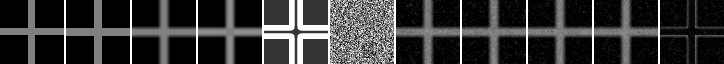
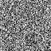
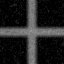
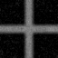
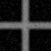
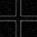

# Model D Texture Term Ablation

## Question

Model D candidate の white-noise texture term は、同一 guide / seed の reconstruction に対して改善、悪化、無影響のどれに見えるか。特に、輝度を一方向へ押す bias が見えるか。

## Hypothesis

現行の white-noise texture は意味的ディテールではなく粒状ノイズに近い。texture_strength を上げても、synthetic cross reference に対する PSNR / SSIM / MAD / edge leakage は改善せず、背景平均や輝度biasを悪化させる可能性がある。

## Setup

- Command: `$env:PYTHONPATH = "src"; .\.venv\Scripts\python.exe experiments/exp_009_texture_ablation.py`
- Date: 2026-05-24
- Experiment seed: 20260524
- Decoder seed: 6400
- Low guide size: 16x16
- Output size: 64x64
- Shape: synthetic cross
- Texture strengths: `[0.0, 0.1, 0.35, 0.7]`
- Model: Model D candidate texture ablation
- Model config except texture: `{'j_base': 1.8, 'lambda_data': 6.0, 'gamma': 35.0}`
- Decode config: `{'sweeps': 35, 'temp_start': 0.35, 'temp_end': 0.01, 'proposal_sigma': 0.08}`
- Texture mapping: strength 0.0 uses a zero texture field and texture_weight=0.0; non-zero strengths scale the same deterministic zero-mean texture field by strength / 0.35 and use strength as texture_weight.
- Python / dependency version: Python 3.12.13, NumPy 2.3.5

## Baseline

baselineは nearest、bilinear、bicubic upscaling とした。ablationの主比較は `texture_strength=0.00` と非ゼロ値の Model D output である。

metricsのreferenceは同じsynthetic crossを64x64で生成した比較用参照であり、自然画像のGround Truthではない。

## Metrics

| Output | MAD vs reference | PSNR vs reference | Global SSIM vs reference | Mean error | Foreground mean | Background mean | Edge leakage | Time seconds |
| --- | ---: | ---: | ---: | ---: | ---: | ---: | ---: | ---: |
| nearest | 0.013794 | 21.613 | 0.915546 | 0.013794 | 0.500000 | 0.017390 | 0.128409 | 0.000184 |
| bilinear | 0.033143 | 21.495 | 0.901668 | 0.018985 | 0.465766 | 0.032859 | 0.219728 | 0.000175 |
| bicubic | 0.035119 | 21.585 | 0.904375 | 0.023736 | 0.496146 | 0.030929 | 0.211894 | 0.098705 |
| texture_0.00 | 0.048270 | 20.994 | 0.879052 | 0.028112 | 0.455266 | 0.047102 | 0.217775 | 1.711186 |
| texture_0.10 | 0.047630 | 21.083 | 0.881177 | 0.028671 | 0.458886 | 0.046864 | 0.217163 | 1.695954 |
| texture_0.35 | 0.047207 | 20.939 | 0.878941 | 0.027561 | 0.457005 | 0.045955 | 0.221531 | 1.712419 |
| texture_0.70 | 0.047522 | 21.017 | 0.880231 | 0.027823 | 0.456653 | 0.046376 | 0.220346 | 1.727080 |

## Saved Artifacts

- Config: `config.json`
- Metrics: `metrics.json`
- Notes: `notes.md`
- Low guide image: `low_guide.png`
- Synthetic comparison reference: `high_reference.png`
- Baseline images: `nearest.png`, `bilinear.png`, `bicubic.png`
- Confidence map: `confidence.png`
- Texture field image: `texture_field.png`
- Rendered Model D images: `rendered_texture_*.png`
- Difference maps vs bilinear: `diff_texture_*_vs_bilinear.png`
- Difference maps vs reference: `diff_texture_*_vs_reference.png`
- Comparison strip: `comparison.png`

## Images

## Result

texture_strength を 0.00 から 0.70 へ変えても、mean error は 0.027561 から 0.028671 の範囲に留まり、background mean も 0.045955 から 0.047102 の範囲で非単調だった。このrunでは、texture_strength に比例した単純な一方向biasは確認できない。一方で、texture_strength=0.00 でも background mean は 0.047102 で、bilinear の background mean 0.032859 より高かったため、現行Model D relaxation経路そのものが背景側の明るさと差分を増やしている可能性がある。

## Interpretation

このrunでは、white-noise texture term は synthetic cross に対する意味のある質感生成としては扱えない。非ゼロtexture_strengthの差は小さく非単調で、PSNR / SSIM / MAD / edge leakage は baseline より改善しなかったため、現行設定では改善要因とは解釈しない。

ただし、現行実装の texture は draft 仕様に書かれた線形項 `texture_strength * sum t_i v_i` そのものではなく、`s_i + texture_i` を平坦部の target とする二乗項と初期状態への混入で効いている。この結果は「現行実装の white-noise texture 経路」の評価であり、structured texture prior 全体の否定ではない。

## Limitations

- synthetic cross 1条件のみの小規模 ablation である。
- metricsのreferenceは実画像Ground Truthではない。
- 現行実装は線形 texture term ではなく、texture target 二乗項と初期状態混入を含む。
- 同じ decoder seed を使っているが、texture_strength により初期状態が変わるため、完全に同一のMarkov chain比較ではない。
- decode timeはこの環境の小画像runに限る。

## Next

- Issue #56 では、この結果を前提に `texture_strength=0` を含め、confidence / data / texture 重みを分けて小規模gridで再評価する。
- Issue #15 / #48 の structured texture prior を使う場合も、white noise baselineとの差分として評価し、意味的ディテール生成とは断定しない。
