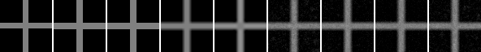
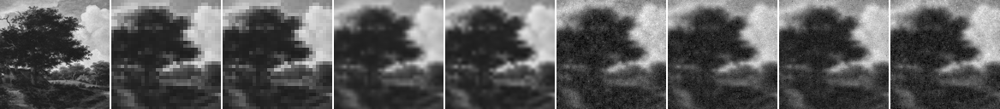

# Model D Weight Grid

## Question

Model D candidate の confidence / data fidelity / texture の主要重みを小規模gridで振ると、nearest / bilinear / bicubic baseline より悪化している原因を切り分けられるか。

## Hypothesis

Issue #37 の texture ablation では、white-noise texture_strength は synthetic cross のbaseline指標を改善しなかった。そのため、`texture_strength=0` を含めて `lambda_data` と confidence map の効き方を分けると、textureよりも data fidelity / confidence 設定が悪化要因として見える可能性がある。

## Setup

- Command: `$env:PYTHONPATH = "src"; .\.venv\Scripts\python.exe experiments/exp_010_model_d_weight_grid.py`
- Date: 2026-05-24
- Experiment seed: 20260524
- Cross decoder seed: 6500
- Natural patch decoder seed: 6501
- Cross: 16x16 guide to 64x64 output
- Natural patch: 32x32 guide to 128x128 output
- Grid configs: `config.json` の `grid_configs`
- Common model params: `{'j_base': 1.8, 'gamma': 35.0}`
- Cross decode config: `{'sweeps': 35, 'temp_start': 0.35, 'temp_end': 0.01, 'proposal_sigma': 0.08}`
- Natural decode config: `{'sweeps': 18, 'temp_start': 0.35, 'temp_end': 0.01, 'proposal_sigma': 0.08}`
- Python / dependency version: Python 3.12.13, NumPy 2.3.5

## Baseline

baselineは cross / natural patch の両方で nearest、bilinear、bicubic upscaling とした。Model D grid はすべて同じ low guide と decoder seed を使う。自然画像patchでは128x128画像をGround Truthとし、32x32 block-average guideから復元した。

## Metrics

### Cross

| Output | MAD vs reference | PSNR | SSIM | Gradient MAD | Edge leakage | Mean error | Time seconds |
| --- | ---: | ---: | ---: | ---: | ---: | ---: | ---: |
| nearest | 0.013794 | 21.613 | 0.915546 | 0.039444 | 0.128409 | 0.013794 | 0.000150 |
| bilinear | 0.033143 | 21.495 | 0.901668 | 0.142559 | 0.219728 | 0.018985 | 0.000155 |
| bicubic | 0.035119 | 21.585 | 0.904375 | 0.129688 | 0.211894 | 0.023736 | 0.092083 |
| current_tex0 | 0.050107 | 20.837 | 0.873352 | 0.197553 | 0.222646 | 0.030630 | 1.681038 |
| low_data_tex0 | 0.065850 | 20.048 | 0.836331 | 0.216382 | 0.219902 | 0.043526 | 1.656307 |
| high_data_tex0 | 0.041562 | 21.312 | 0.891896 | 0.155136 | 0.217599 | 0.024219 | 1.656111 |
| high_floor_tex0 | 0.042308 | 21.161 | 0.888839 | 0.126557 | 0.221284 | 0.023617 | 1.655349 |
| flat_conf_tex0 | 0.040301 | 21.180 | 0.891161 | 0.151964 | 0.222161 | 0.021336 | 1.661172 |
| current_tex035 | 0.047997 | 21.006 | 0.879380 | 0.188698 | 0.220083 | 0.028512 | 1.662400 |

### Natural Patch

| Output | MAD vs GT | PSNR | SSIM | Gradient MAD | Strong-edge MAD | Mean error | Time seconds |
| --- | ---: | ---: | ---: | ---: | ---: | ---: | ---: |
| nearest | 0.045384 | 22.578 | 0.953421 | 0.092455 | 0.089966 | -0.004017 | 0.000186 |
| bilinear | 0.044369 | 23.276 | 0.959480 | 0.094319 | 0.082830 | -0.003177 | 0.000376 |
| bicubic | 0.042397 | 23.578 | 0.962820 | 0.090419 | 0.081152 | -0.003131 | 0.375583 |
| current_tex0 | 0.056345 | 22.142 | 0.947779 | 0.143257 | 0.087382 | -0.003135 | 3.495002 |
| low_data_tex0 | 0.059991 | 21.739 | 0.942936 | 0.157542 | 0.090724 | -0.001907 | 3.475463 |
| high_data_tex0 | 0.053470 | 22.464 | 0.951359 | 0.159725 | 0.086420 | -0.003434 | 3.538719 |
| high_floor_tex0 | 0.054377 | 22.340 | 0.950010 | 0.136148 | 0.087753 | -0.002787 | 3.573359 |
| flat_conf_tex0 | 0.052882 | 22.410 | 0.950747 | 0.117206 | 0.087344 | -0.003653 | 3.547200 |
| current_tex035 | 0.056136 | 22.204 | 0.948235 | 0.148145 | 0.087348 | -0.003571 | 3.547652 |

## Saved Artifacts

- Config: `config.json`
- Metrics: `metrics.json`
- Notes: `notes.md`
- Cross artifacts: `cross/`
- Natural patch artifacts: `natural_patch/`
- Each case includes baseline PNGs, grid rendered PNGs, confidence maps, difference maps, and `comparison.png`.

## Images

## Result

Cross の Model D grid内では `flat_conf_tex0` が最小MADだった。Natural patch の Model D grid内では `flat_conf_tex0` が最小MADだった。

## Interpretation

この小規模gridでは、Model D grid のどの条件も nearest / bilinear / bicubic baseline を総合的に上回ったとは解釈しない。`texture_strength=0` を含めてもbaseline差分は残るため、Issue #37 の結果と合わせると、white-noise textureだけではなく、現行の relaxation、confidence map、data fidelity、pairwise interaction の組み合わせ自体を再設計またはより細かく切り分ける必要がある。

confidence map の効果と texture term の効果は混ぜて解釈しない。`flat_conf_tex0` は confidence の空間変化を外した比較条件であり、`current_tex035` は texture 経路を残した現行寄り条件である。両者を直接「質感生成の良し悪し」として扱わず、baseline差分とmetricsの変化として読む。

## Limitations

- gridは6条件のみで、最適化探索ではない。
- crossと1枚のpublic-domain自然画像patchだけの結果である。
- Global SSIM は依存なしの全画像SSIMであり、windowed SSIMではない。
- 現行実装の texture はdraft仕様の線形項そのものではなく、texture target二乗項と初期状態混入を含む。
- decode timeはこの環境の小画像runに限る。
- この結果はsuper-resolutionやcompressionの成立を示さず、またそれらを一般に否定する結果でもない。

## Next

- 次に進めるなら、現行Model Dの式を固定したgrid拡大よりも、data fidelity / pairwise interaction / confidence map の設計を分離した小さな対照実験にする。Follow-up: Issue #61。
- structured texture prior を評価する場合も、`texture_strength=0` と white-noise baseline を含め、意味的ディテール生成とは断定しない。
