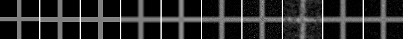
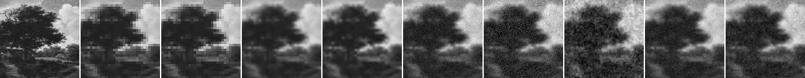

# Model D Term Isolation

## Question

Model D candidate の data fidelity、pairwise interaction、confidence map を項ごとに分けると、nearest / bilinear / bicubic baseline より悪化している要因をより直接的に確認できるか。

## Hypothesis

Issue #56 では `flat_conf_tex0` がgrid内で相対的に良かったが、単純補間を上回らなかった。このため、gradient confidence の空間変化、pairwise interaction、data fidelity のどれが悪化に寄与しているかを、texture_strength=0 固定の対照実験で分離する必要がある。

## Setup

- Command: `$env:PYTHONPATH = "src"; .\.venv\Scripts\python.exe experiments/exp_011_model_d_term_isolation.py`
- Date: 2026-05-24
- Experiment seed: 20260524
- Cross decoder seed: 6600
- Natural patch decoder seed: 6601
- Texture strength: 0.0 for all Model D term conditions
- Cross: 16x16 guide to 64x64 output
- Natural patch: 32x32 guide to 128x128 output
- Term configs: `config.json` の `term_configs`
- Common model params: `{'gamma': 35.0, 'texture_weight': 0.0}`
- Cross decode config: `{'sweeps': 35, 'temp_start': 0.35, 'temp_end': 0.01, 'proposal_sigma': 0.08}`
- Natural decode config: `{'sweeps': 18, 'temp_start': 0.35, 'temp_end': 0.01, 'proposal_sigma': 0.08}`
- Python / dependency version: Python 3.12.13, NumPy 2.3.5

## Baseline

baselineは cross / natural patch の両方で nearest、bilinear、bicubic upscaling とした。Model D term conditions はすべて `texture_strength=0` とし、data fidelity、pairwise interaction、confidence weighting の有無を分けた。

## Metrics

### Cross

| Output | MAD vs reference | PSNR | SSIM | Gradient MAD | Edge leakage | Mean error | Time seconds |
| --- | ---: | ---: | ---: | ---: | ---: | ---: | ---: |
| nearest | 0.013794 | 21.613 | 0.915546 | 0.039444 | 0.128409 | 0.013794 | 0.000230 |
| bilinear | 0.033143 | 21.495 | 0.901668 | 0.142559 | 0.219728 | 0.018985 | 0.000229 |
| bicubic | 0.035119 | 21.585 | 0.904375 | 0.129688 | 0.211894 | 0.023736 | 0.205799 |
| data_only_uniform | 0.042810 | 21.058 | 0.886449 | 0.154907 | 0.221468 | 0.024874 | 2.882245 |
| data_only_conf | 0.064851 | 19.624 | 0.828077 | 0.198038 | 0.218642 | 0.044430 | 3.459940 |
| pairwise_only | 0.129615 | 16.336 | 0.634318 | 0.240493 | 0.268231 | 0.096641 | 3.524807 |
| data_pairwise_uniform | 0.040357 | 21.286 | 0.893341 | 0.147349 | 0.218819 | 0.021207 | 3.498156 |
| data_pairwise_conf | 0.049139 | 20.918 | 0.876100 | 0.189205 | 0.219880 | 0.030245 | 3.602774 |

### Natural Patch

| Output | MAD vs GT | PSNR | SSIM | Gradient MAD | Strong-edge MAD | Mean error | Time seconds |
| --- | ---: | ---: | ---: | ---: | ---: | ---: | ---: |
| nearest | 0.045384 | 22.578 | 0.953421 | 0.092455 | 0.089966 | -0.004017 | 0.000224 |
| bilinear | 0.044369 | 23.276 | 0.959480 | 0.094319 | 0.082830 | -0.003177 | 0.000807 |
| bicubic | 0.042397 | 23.578 | 0.962820 | 0.090419 | 0.081152 | -0.003131 | 0.876458 |
| data_only_uniform | 0.057015 | 21.999 | 0.946320 | 0.122405 | 0.088972 | -0.002638 | 7.471161 |
| data_only_conf | 0.069065 | 20.793 | 0.929581 | 0.140084 | 0.092080 | -0.001583 | 4.787978 |
| pairwise_only | 0.071348 | 20.449 | 0.923022 | 0.161105 | 0.100794 | 0.000010 | 4.390244 |
| data_pairwise_uniform | 0.052912 | 22.428 | 0.950993 | 0.130082 | 0.087986 | -0.003399 | 3.895387 |
| data_pairwise_conf | 0.056437 | 22.152 | 0.947742 | 0.144063 | 0.088040 | -0.002354 | 4.004903 |

## Saved Artifacts

- Config: `config.json`
- Metrics: `metrics.json`
- Notes: `notes.md`
- Cross artifacts: `cross/`
- Natural patch artifacts: `natural_patch/`
- Each case includes baseline PNGs, term-condition rendered PNGs, confidence maps, difference maps, and `comparison.png`.

## Images

## Result

Cross の term conditions 内では `data_pairwise_uniform` が最小MADだった。Natural patch の term conditions 内では `data_pairwise_uniform` が最小MADだった。

## Interpretation

このrunでは、data fidelity only、pairwise only、data+pairwise、confidence-weighted data のいずれも nearest / bilinear / bicubic baseline を総合的に上回ったとは解釈しない。特に `data_only_uniform` や `data_pairwise_uniform` が既存の `data_pairwise_conf` より良い場合でも、それは Model D がbaselineを改善したことではなく、現行gradient confidenceの空間重み付けがこの設定では有利に働いていない可能性を示す切り分け結果である。

pairwise-only 条件は、guideへのdata fidelityを持たないため、画像復元条件としては不十分である。これはpairwise interaction単体の挙動を見るための対照条件であり、候補モデルとして採用する条件ではない。

## Limitations

- crossと1枚のpublic-domain自然画像patchだけの結果である。
- term isolation は現行 `model_d_decode` のパラメータを使った対照実験であり、別形式のdecoder objectiveを実装したものではない。
- Global SSIM は依存なしの全画像SSIMであり、windowed SSIMではない。
- decode timeはこの環境の小画像runに限る。
- この結果はsuper-resolutionやcompressionの成立を示さず、またそれらを一般に否定する結果でもない。

## Next

- 現行Model D式の単純な重み探索はいったん止め、confidence map の作り方または pairwise term の設計を別候補として再設計する。Follow-up: Issue #67。
- structured texture prior を評価する場合も、今回のような term-isolated baseline と white-noise baseline を含める。
