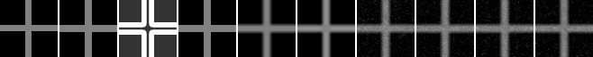
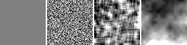
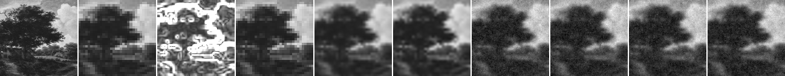
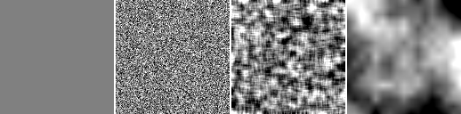

# Structured Texture Prior Comparison

## Question

Model D の現行 white-noise texture baseline と比べて、smoothed noise / fractal value noise は cross と自然画像patchの再構成指標に改善要因として見えるか。

## Hypothesis

white noise は粒状感に寄りやすいため、smoothed noise や fractal value noise は視覚的な粒状差分を変える可能性がある。ただし、現行 Model D の relaxation / confidence / data fidelity の組み合わせでは、structured texture prior だけで nearest / bilinear / bicubic baseline を上回るとは仮定しない。

## Setup

- Command: `$env:PYTHONPATH = "src"; .\.venv\Scripts\python.exe experiments/exp_014_structured_texture_prior.py`
- Date: 2026-05-24
- Experiment seed: 20260524
- Cross decoder seed: 6630
- Natural patch decoder seed: 6631
- Cross: 16x16 guide to 64x64 output
- Natural patch: 32x32 guide to 128x128 output
- Texture sigma: 0.035
- Texture configs: `config.json` の `texture_configs`
- Common Model D params: `{'j_base': 1.8, 'lambda_data': 6.0, 'gamma': 35.0}`
- Cross decode config: `{'sweeps': 35, 'temp_start': 0.35, 'temp_end': 0.01, 'proposal_sigma': 0.08}`
- Natural decode config: `{'sweeps': 18, 'temp_start': 0.35, 'temp_end': 0.01, 'proposal_sigma': 0.08}`
- Python / dependency version: Python 3.12.13, NumPy 2.3.5

## Baseline

baseline は cross / natural patch の両方で nearest、bilinear、bicubic upscaling とした。Model D 条件には `texture_0`、`white_noise`、`smoothed_noise`、`fractal_value_noise` を含めた。structured texture prior は、white-noise baseline との差分として評価し、意味的ディテール生成とは扱わない。

## Metrics

### Cross

| Output | MAD vs reference | PSNR | SSIM | Gradient MAD | Edge leakage | Mean error | Time seconds |
| --- | ---: | ---: | ---: | ---: | ---: | ---: | ---: |
| nearest | 0.013794 | 21.613 | 0.915546 | 0.039444 | 0.128409 | 0.013794 | 0.000137 |
| bilinear | 0.033143 | 21.495 | 0.901668 | 0.142559 | 0.219728 | 0.018985 | 0.000175 |
| bicubic | 0.035119 | 21.585 | 0.904375 | 0.129688 | 0.211894 | 0.023736 | 0.105893 |
| texture_0 | 0.049595 | 20.904 | 0.875847 | 0.192632 | 0.220348 | 0.029460 | 1.803184 |
| white_noise | 0.046823 | 20.946 | 0.879541 | 0.180740 | 0.222580 | 0.027242 | 1.858371 |
| smoothed_noise | 0.048186 | 20.906 | 0.876975 | 0.183834 | 0.221193 | 0.029050 | 1.911958 |
| fractal_value_noise | 0.047818 | 20.942 | 0.878380 | 0.166141 | 0.220408 | 0.027763 | 1.885865 |

### Natural Patch

| Output | MAD vs GT | PSNR | SSIM | Gradient MAD | Strong-edge MAD | Mean error | Time seconds |
| --- | ---: | ---: | ---: | ---: | ---: | ---: | ---: |
| nearest | 0.045384 | 22.578 | 0.953421 | 0.092455 | 0.089966 | -0.004017 | 0.000164 |
| bilinear | 0.044369 | 23.276 | 0.959480 | 0.094319 | 0.082830 | -0.003177 | 0.000399 |
| bicubic | 0.042397 | 23.578 | 0.962820 | 0.090419 | 0.081152 | -0.003131 | 0.425257 |
| texture_0 | 0.056006 | 22.228 | 0.948636 | 0.143470 | 0.086854 | -0.002029 | 4.277945 |
| white_noise | 0.056064 | 22.208 | 0.948224 | 0.120921 | 0.087755 | -0.002432 | 4.210911 |
| smoothed_noise | 0.056407 | 22.155 | 0.947850 | 0.157071 | 0.087672 | -0.002325 | 4.337164 |
| fractal_value_noise | 0.056222 | 22.169 | 0.948166 | 0.133615 | 0.087236 | -0.002099 | 4.232639 |

## Saved Artifacts

- Config: `config.json`
- Metrics: `metrics.json`
- Notes: `notes.md`
- Cross artifacts: `cross/`
- Natural patch artifacts: `natural_patch/`
- Each case includes baseline PNGs, texture field PNGs, rendered PNGs, difference maps, confidence map, and `comparison.png`.

## Images

## Result

Cross の Model D texture 条件内では `white_noise` が最小MADだった。Natural patch の Model D texture 条件内では `texture_0` が最小MADだった。

## Interpretation

このrunでは、structured texture prior 候補が単純補間 baseline を総合的に上回ったとは解釈しない。white noise と structured texture の差は同じ settings で比較できる形になったが、cross と自然画像patchのどちらでも texture prior だけを改善要因として断定するには足りない。結果は、現行 Model D の texture 経路に structured field を入れたときの小規模な差分記録として扱う。

## Limitations

- cross と1枚の public-domain 自然画像patchだけの小規模比較である。
- 現行実装の texture は draft 仕様の線形項そのものではなく、texture target 二乗項と初期状態混入を含む。
- 同じ decoder seed を使っているが、texture field が異なるため完全に同一の Markov chain 比較ではない。
- Global SSIM は依存なしの全画像SSIMであり、windowed SSIMではない。
- decode time はこの環境の小画像runに限る。
- この結果は意味的ディテール生成、super-resolution、compression の成立を示さない。

## Next

- confidence map や pairwise term の再設計候補は Issue #67 で扱う。
- structured texture を続ける場合は、より自然な texture 評価に向いた複数patchと、texture経路自体の式の見直しを別Issueで検討する。
