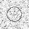
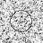
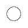

# Model C と Perona-Malik 型 diffusion の形状別比較: circle

## Question

Model C の guide-derived fixed weight と Perona-Malik 型 diffusion の state-derived conductance の違いは、`circle` でも確認できるか。

## Hypothesis

hard edge shape では、両者とも大きな局所差をまたぐ混合を弱めるが、Model C は noisy guide から固定weightを作り、Perona-Malik 型 diffusion は現在状態から conductance を更新するため、weight / conductance map の読み方は一致しない。soft gradient では明確な境界がないため、edge leakage ではなく階調の単調性と滑らかさで確認する。

## Setup

- Command: `$env:PYTHONPATH = "src"; .\.venv\Scripts\python.exe experiments/exp_013_model_c_perona_malik_shapes.py`
- Date: 2026-05-24
- Experiment seed: 20260525
- Decoder seed: 6465
- Input: 48x48 synthetic `circle` with deterministic Gaussian noise
- Model C params: `{'j_base': 2.0, 'lambda_data': 5.0, 'gamma': 40.0}`
- Model C anneal config: `{'sweeps': 60, 'temp_start': 0.45, 'temp_end': 0.01, 'proposal_sigma': 0.09}`
- Perona-Malik config: `{'steps': 60, 'dt': 0.18, 'kappa': 0.11}`
- Python / dependency version: Python 3.12.13, NumPy 2.3.5

## Baseline

Baseline は noisy initial guide をそのまま表示する `initial_noisy.png` とした。Perona-Malik 型 diffusion は、この noisy initial から画像勾配ベースの conductance で明示的に反復更新する比較対象である。

## Metrics

| Output | MAD vs clean | PSNR vs clean | Global SSIM vs clean | Gradient MAD vs clean | Edge leakage | Decode time seconds |
| --- | ---: | ---: | ---: | ---: | ---: | ---: |
| initial_noisy | 0.035329 | 27.121 | 0.979282 | 0.075100 | 0.079115 | N/A |
| model_c | 0.028700 | 28.804 | 0.985851 | 0.053402 | 0.071592 | 1.033684 |
| perona_malik | 0.002569 | 49.490 | 0.999877 | 0.000708 | 0.080081 | 0.005068 |

## Pair Weight / Conductance Summary

hard edge shape では `boundary_pair_mean` を true mask をまたぐ4近傍pair、`flat_pair_mean` をそれ以外のpairとして計算した。soft gradient では明確な境界がないため、boundary 系は `N/A` とし、全pair平均だけを保存した。

| Map | Flat pair mean | Boundary pair mean | Boundary / flat |
| --- | ---: | ---: | ---: |
| model_c_guide_weight | 1.743884 | 0.000155 | 0.000089 |
| pm_initial_conductance | 0.777904 | 0.000000 | 0.000000 |
| pm_final_conductance | 0.999982 | 0.000000 | 0.000000 |

## Saved Artifacts

- Config: `config.json`
- Metrics: `metrics.json`
- Clean guide: `clean_guide.png`
- Initial noisy guide: `initial_noisy.png`
- Model C output: `model_c.png`
- Perona-Malik output: `perona_malik.png`
- Model C guide weight map: `model_c_weight_map.png`
- Perona-Malik initial conductance map: `pm_conductance_initial_map.png`
- Perona-Malik final conductance map: `pm_conductance_final_map.png`
- Difference maps: `diff_model_c_vs_clean.png`, `diff_pm_vs_clean.png`
- Comparison strip: `comparison.png`

## Images

## Result

`circle` について、Model C と Perona-Malik 型 diffusion の出力、差分、guide-derived weight、state-derived conductance を保存した。

## Interpretation

この形状でも、Model C のweightは入力guideから固定的に決まり、Perona-Malik 型のconductanceは初期状態とdiffusion後で変化するものとして確認できる。metricsの良し悪しは、この小規模synthetic条件での比較結果として扱い、一般的な優位性とは解釈しない。

## Limitations

- synthetic `circle` 1条件の小規模比較であり、一般画像品質を示さない。
- Perona-Malik 実装は最小の明示的diffusion loopであり、元論文の数値解析や安定性検討を網羅しない。
- Model C は stochastic relaxation なので、seed、sweeps、temperature schedule に依存する。
- この結果は compression、super-resolution、Model C の一般的優位性を示すものではない。

## Next

- Perona-Malik 型以外の guided filtering / anisotropic smoothing baseline と比較する場合は、低解像度guide条件と高解像度guidance条件を分ける。
- Model C freeze criteria として使う場合は、shape別の合格目安を別途定義する。
