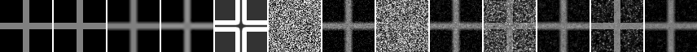
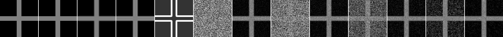

# Model C/D Decode Sweep Quality Benchmark

## Question

Model C / Model D の sweep 数を増やしたとき、decode time と synthetic cross に対する比較指標はどう変わるか。

## Hypothesis

現行の Python Metropolis 型 relaxation decoder は、同じ画像サイズでは sweep 数にほぼ比例して decode time が増える。品質指標は短い sweep から改善する可能性があるが、単純補間 baseline との差は別に確認する必要がある。

## Setup

- Command: `$env:PYTHONPATH = "src"; .\.venv\Scripts\python.exe experiments/exp_012_decode_sweep_quality.py`
- Date: 2026-05-24
- Experiment seed: 20260524
- Decoder seed base: 6500
- Output sizes: [64, 128]
- Sweeps: [1, 4, 12, 24]
- Shape: synthetic cross
- Model C config: `{'j_base': 2.0, 'lambda_data': 5.0, 'gamma': 40.0}`
- Model D config: `{'j_base': 1.8, 'lambda_data': 6.0, 'gamma': 35.0, 'texture_weight': 0.35}`
- Decode config: `{'temp_start': 0.35, 'temp_end': 0.01, 'proposal_sigma': 0.08}`
- Python / dependency version: Python 3.12.13, NumPy 2.3.5

## Baseline

baseline は nearest、bilinear、bicubic upscaling とした。baseline はサイズごとに一度だけ計測し、sweep 数による変化とは分けて扱う。metrics の reference は同じ synthetic cross を高解像度で生成した比較用参照であり、実画像の Ground Truth ではない。

| Size | Nearest seconds | Bilinear seconds | Bicubic seconds | Nearest MAD | Bilinear MAD | Bicubic MAD |
| --- | ---: | ---: | ---: | ---: | ---: | ---: |
| 64x64 | 0.000298 | 0.000341 | 0.208682 | 0.000000 | 0.028289 | 0.029339 |
| 128x128 | 0.000293 | 0.000620 | 0.978607 | 0.000000 | 0.013909 | 0.014403 |

## Result

| Size | Sweeps | Model C seconds | Model D seconds | Model C MAD | Model D MAD | Model C SSIM | Model D SSIM | Model C edge leakage | Model D edge leakage |
| --- | ---: | ---: | ---: | ---: | ---: | ---: | ---: | ---: | ---: |
| 64x64 | 1 | 0.057836 | 0.088701 | 0.428383 | 0.052491 | 0.010130 | 0.899163 | 0.481148 | 0.158310 |
| 64x64 | 4 | 0.224077 | 0.333854 | 0.384336 | 0.056353 | 0.051700 | 0.898241 | 0.462754 | 0.154962 |
| 64x64 | 12 | 0.557721 | 0.997263 | 0.248061 | 0.056202 | 0.283431 | 0.900301 | 0.277039 | 0.160108 |
| 64x64 | 24 | 1.610450 | 2.811896 | 0.099229 | 0.048408 | 0.729132 | 0.915968 | 0.112877 | 0.160410 |
| 128x128 | 1 | 0.303640 | 0.479801 | 0.426336 | 0.042792 | 0.014306 | 0.930528 | 0.481895 | 0.153341 |
| 128x128 | 4 | 1.103218 | 2.112702 | 0.384720 | 0.045635 | 0.053857 | 0.928891 | 0.453018 | 0.156655 |
| 128x128 | 12 | 3.368313 | 5.581960 | 0.258509 | 0.048406 | 0.266464 | 0.924881 | 0.312231 | 0.158683 |
| 128x128 | 24 | 6.770186 | 11.329106 | 0.107228 | 0.037375 | 0.707335 | 0.947361 | 0.134788 | 0.157015 |

## Saved Artifacts

- Config: `config.json`
- Metrics: `metrics.json`
- Per-size metrics: `<size>x<size>/metrics.json`
- Per-size PNGs: `high_reference.png`, `low_guide.png`, `nearest.png`, `bilinear.png`, `bicubic.png`, `confidence.png`
- Per-sweep PNGs: `rendered_model_c_sweeps_*.png`, `rendered_model_d_sweeps_*.png`, `diff_model_d_sweeps_*_vs_bilinear.png`, `comparison_sweeps_*.png`

## Images

各sizeの `comparison_sweep_summary.png` に、reference、baselines、confidence、各sweepの Model C / Model D 出力を横並びで保存した。

## Interpretation

今回の測定では、同じ画像サイズ内で sweep 数を増やすと Model C / Model D の decode time はおおむね増加した。Model D は sweep 数を増やすと synthetic reference への MAD が改善したが、64x64 / 128x128 とも bilinear / bicubic baseline の MAD よりは悪かった。Model C はこの multi-resolution 比較では高解像度 synthetic reference を直接 guide としているため、Model D や low-resolution baseline と同じ役割の復元器として比較しない。

## Limitations

- synthetic cross のみで、自然画像patchやsoft gradientでは未確認。
- metrics の reference は synthetic high-resolution cross であり、実画像の Ground Truth ではない。
- 画素数 scaling は `results/2026-05-17-issue-35-decode-time-scaling/` の結果を参照し、本実験では同一サイズ内の sweep scaling を中心に読む。
- 現行 Python 実装の実行時間であり、Rust core、固定小数点、並列化、近似更新では未評価。
- Model D はこの条件でも単純補間 baseline を上回っておらず、実用圧縮形式や super-resolution 性能を示す結果ではない。

## Next

- Model C / D の更新ループ高速化や Rust core 化を検討するときは、この sweep scaling を Python 実装の制限として参照する。
- 品質改善の検討は、sweep 数だけを増やすよりも Issue #67 の confidence map / pairwise term 再設計候補と分けて進める。
