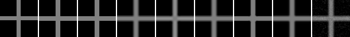
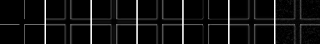
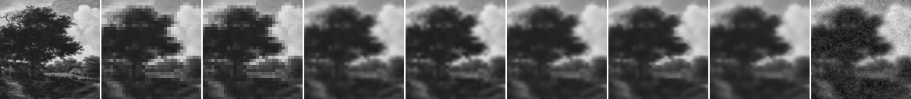
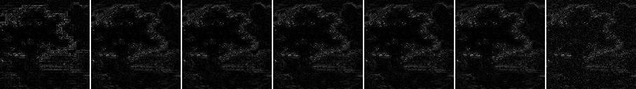

# Guided Filter系BaselineとModel Dの比較

## Question

低解像度guideだけから作るedge-aware filtering baselineは、nearest / bilinear / bicubicおよび現行Model D candidateと比べて、crossと自然画像patchの再構成指標を改善するか。

## Hypothesis

guided filter、joint bilateral refinement、bilateral smoothingは、単純補間より局所的なedge-aware処理を行う。ただし独立した高解像度guidanceを使わないため、低解像度guideで失われた詳細を復元するとは仮定しない。

## Setup

- Command: `$env:PYTHONPATH = "src"; .\.venv\Scripts\python.exe experiments/exp_015_guided_filter_baselines.py`
- Date: 2026-06-07
- Experiment seed: 20260607
- Cross decoder seed: 6740
- Natural patch decoder seed: 6741
- Cross: 16x16 guide to 64x64 output
- Natural patch: 32x32 guide to 128x128 output
- Edge-aware configs: `config.json` の `edge_aware_configs`
- Model D params: `{'j_base': 1.8, 'lambda_data': 6.0, 'gamma': 35.0, 'texture_weight': 0.35}`
- Python / dependency version: Python 3.12.13, NumPy 2.3.5

## Baseline

nearest、bilinear、bicubicに加え、次のedge-aware baselineを比較した。

- `guided_filter`: bilinear-upscaled low guideを入力と自己guidanceの両方に使う。
- `joint_bilateral`: nearest-upscaled値を、bilinear-upscaled low guideで重み付けしてrefineする。
- `bilateral_smoothing`: bilinear-upscaled low guideを入力とguidanceの両方に使う。

いずれも独立した高解像度guidance imageは使わない。したがって、一般的なjoint bilateral upsamplingで高解像度RGB guidanceを利用する条件とは分けて扱う。

## Metrics

### Cross

| Output | MAD vs reference | PSNR | SSIM | Gradient MAD | Edge leakage | Time seconds |
| --- | ---: | ---: | ---: | ---: | ---: | ---: |
| nearest | 0.013794 | 21.613 | 0.915546 | 0.039444 | 0.128409 | 0.002507 |
| bilinear | 0.033143 | 21.495 | 0.901668 | 0.142559 | 0.219728 | 0.000798 |
| bicubic | 0.035119 | 21.585 | 0.904375 | 0.129688 | 0.211894 | 0.193148 |
| guided_filter | 0.033334 | 21.495 | 0.901557 | 0.142162 | 0.219701 | 0.001886 |
| joint_bilateral | 0.019354 | 22.602 | 0.928353 | 0.068129 | 0.155588 | 0.003442 |
| bilateral_smoothing | 0.033952 | 21.550 | 0.902194 | 0.126893 | 0.217306 | 0.002802 |
| model_d | 0.047228 | 21.019 | 0.880240 | 0.182920 | 0.219538 | 3.966922 |

### Natural Patch

| Output | MAD vs GT | PSNR | SSIM | Gradient MAD | Strong-edge MAD | Time seconds |
| --- | ---: | ---: | ---: | ---: | ---: | ---: |
| nearest | 0.045384 | 22.578 | 0.953421 | 0.092455 | 0.089966 | 0.000206 |
| bilinear | 0.044369 | 23.276 | 0.959480 | 0.094319 | 0.082830 | 0.001090 |
| bicubic | 0.042397 | 23.578 | 0.962820 | 0.090419 | 0.081152 | 0.885772 |
| guided_filter | 0.044755 | 23.248 | 0.959171 | 0.092427 | 0.082989 | 0.005407 |
| joint_bilateral | 0.043522 | 23.396 | 0.960646 | 0.073171 | 0.081718 | 0.014355 |
| bilateral_smoothing | 0.046435 | 23.027 | 0.956793 | 0.083218 | 0.084293 | 0.010447 |
| model_d | 0.057154 | 22.069 | 0.946566 | 0.140770 | 0.088449 | 8.853182 |

## Saved Artifacts

- Config: `config.json`
- Metrics: `metrics.json`
- Cross artifacts: `cross/`
- Natural patch artifacts: `natural_patch/`
- 各caseに入力、全出力、referenceとの差分、confidence map、比較PNGを保存した。

## Images

## Result

CrossでMADが最小だったのは `nearest`、natural patchでMADが最小だったのは `bicubic` だった。

## Interpretation

Crossでは `joint_bilateral` がedge-aware条件内の最小MAD `0.019354` だったが、nearestの `0.013794` には届かなかった。Natural patchでは `joint_bilateral` のMAD `0.043522` とgradient MAD `0.073171` はbilinearの `0.044369` と `0.094319` より小さかったが、MADではbicubicの `0.042397` が最小だった。

現行Model Dはcross MAD `0.047228`、natural patch MAD `0.057154` で、このrunの補間およびedge-aware baselineを上回らなかった。これは低解像度guideだけから構成したbaselineとの最小比較であり、高解像度guidanceを持つ既存手法全般の性能を示すものではない。またModel Dまたはedge-aware baselineの優劣は、crossと1枚のnatural patchで観測された範囲に限る。

## Limitations

- crossと1枚のpublic-domain自然画像patchだけの比較である。
- guided filterとbilateral系のパラメータは小規模な固定値であり、網羅的探索はしていない。
- すべてのedge-aware baselineはupscaled low guideからguidanceを作る。独立した高解像度guidanceを使う標準的なjoint upsampling条件とは異なる。
- Global SSIMは依存なしの全画像SSIMであり、windowed SSIMではない。
- decode timeはこの環境の小画像runに限る。
- この結果はsuper-resolutionやcompressionの成立を示さない。

## Next

- confidence mapとpairwise termの再設計候補はIssue #67で、今回のedge-aware baselineを比較対象として利用できる。
- 独立した高解像度guidanceを使う比較が必要になった場合は、SIDFのlow-guide-only条件と別条件として明示する。
