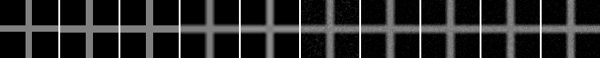
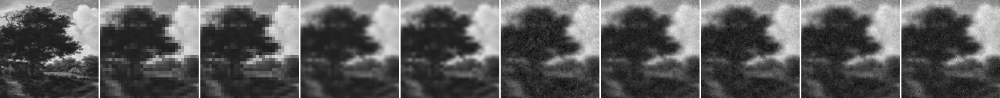
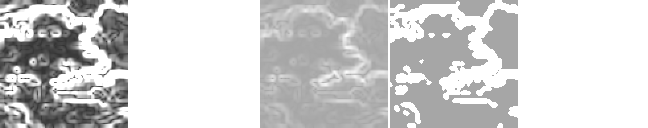

# Model D Confidence / Pairwise Redesign Candidates

## Question

Issue #61 で現行gradient confidenceがuniform confidenceより悪かった結果を受け、confidence mapの形とpairwise penaltyの形を小さく変更すると、crossと自然画像patchのreference差分は改善するか。

## Hypothesis

現行gradient confidenceより空間変化を弱めた `flatter` またはedge近傍だけを強く拘束する `edge_band` は、低confidence領域でのdriftを減らす可能性がある。また、大きな画素差に対するpairwise penaltyをclampすると、境界をまたぐ過度な平滑化を抑える可能性がある。

## Setup

- Command: `$env:PYTHONPATH = "src"; .\.venv\Scripts\python.exe experiments/exp_018_model_d_redesign_candidates.py`
- Date: 2026-06-14
- Experiment seed: 20260614
- Cross decoder seed: 6700
- Natural patch decoder seed: 6701
- Texture strength: 0.0（全条件）
- Cross: 16x16 guideから64x64 output
- Natural patch: 32x32 guideから128x128 output
- Conditions: `config.json` の `conditions`
- Model params: `{'j_base': 1.8, 'lambda_data': 6.0, 'gamma': 35.0, 'pairwise_cap': 0.08}`
- Pairwise redesign: `min((v_i - v_j)^2, pairwise_cap^2)` をclamped条件で使用
- Python / dependency version: Python 3.12.13, NumPy 2.3.5

## Baseline

nearest、bilinear、bicubicを共通baselineとした。`uniform_quadratic` はIssue #61の最良term条件に対応する対照、`current_gradient_quadratic` は現行confidence設計、`flatter_quadratic` と `edge_band_quadratic` はconfidence再設計、`uniform_clamped_pairwise` はpairwise再設計である。

## Metrics

### Cross

| Output | MAD vs reference | PSNR | Global SSIM | Gradient magnitude MAD | Edge leakage | Time seconds |
| --- | ---: | ---: | ---: | ---: | ---: | ---: |
| nearest | 0.013794 | 21.613 | 0.915546 | 0.013946 | 0.128409 | 0.000126 |
| bilinear | 0.033143 | 21.495 | 0.901668 | 0.030511 | 0.219728 | 0.000159 |
| bicubic | 0.035119 | 21.585 | 0.904375 | 0.030838 | 0.211894 | 0.099786 |
| current_gradient_quadratic | 0.050055 | 20.797 | 0.872209 | 0.046065 | 0.223620 | 1.120666 |
| uniform_quadratic | 0.040642 | 21.172 | 0.890547 | 0.038050 | 0.223300 | 1.084550 |
| flatter_quadratic | 0.041190 | 21.241 | 0.891270 | 0.038933 | 0.220761 | 1.078899 |
| edge_band_quadratic | 0.041273 | 21.256 | 0.891321 | 0.038734 | 0.220635 | 1.335600 |
| uniform_clamped_pairwise | 0.038978 | 21.375 | 0.895715 | 0.037114 | 0.217171 | 1.209665 |

### Natural Patch

| Output | MAD vs GT | PSNR | Global SSIM | Gradient magnitude MAD | Strong-edge MAD | Time seconds |
| --- | ---: | ---: | ---: | ---: | ---: | ---: |
| nearest | 0.045384 | 22.578 | 0.953421 | 0.033359 | 0.089966 | 0.000224 |
| bilinear | 0.044369 | 23.276 | 0.959480 | 0.030565 | 0.082830 | 0.000750 |
| bicubic | 0.042397 | 23.578 | 0.962820 | 0.029326 | 0.081152 | 0.426366 |
| current_gradient_quadratic | 0.056744 | 22.115 | 0.947095 | 0.034435 | 0.087792 | 2.380588 |
| uniform_quadratic | 0.052474 | 22.487 | 0.951697 | 0.032127 | 0.087055 | 2.381542 |
| flatter_quadratic | 0.054494 | 22.257 | 0.949075 | 0.033084 | 0.088258 | 2.477684 |
| edge_band_quadratic | 0.054277 | 22.288 | 0.949320 | 0.032903 | 0.087664 | 2.469567 |
| uniform_clamped_pairwise | 0.054536 | 22.222 | 0.948827 | 0.033906 | 0.087854 | 2.730167 |

## Saved Artifacts

- Config: `config.json`
- Metrics: `metrics.json`
- Notes: `notes.md`
- Cross artifacts: `cross/`
- Natural patch artifacts: `natural_patch/`
- 各caseにbaseline、各候補、confidence map、reference/bilinear差分、`comparison.png`、`confidence_comparison.png` を保存した。

## Images

## Result

Model D候補内の最小MADは、crossでは `uniform_clamped_pairwise` の `0.038978`、natural patchでは `uniform_quadratic` の `0.052474` だった。

## Interpretation

`uniform_clamped_pairwise` はcrossで `uniform_quadratic` よりMADとedge leakageを改善したが、natural patchではMAD、SSIM、gradient magnitude MADが悪化した。`flatter_quadratic` と `edge_band_quadratic` は現行gradient confidenceより良かったものの、両caseで `uniform_quadratic` を一貫して上回らなかった。

さらに、crossではnearest、natural patchではbicubicがMAD、SSIM、gradient magnitude MADの主要値で全Model D候補より良かった。したがって、今回のconfidence 2案とclamped pairwiseをModel D draftへ採用する根拠は得られなかった。これは候補を小さく比較したnegative resultであり、confidence map一般、robust pairwise一般、super-resolution、compressionの可否を示すものではない。

## Limitations

- crossと1枚のpublic-domain自然画像patchだけの比較である。
- confidence候補のfloor、edge-band quantile、pairwise capは各1設定のみであり、広い探索ではない。
- clamped pairwiseはtruncated quadraticの実験候補で、正式な確率モデルや仕様ではない。
- Global SSIMは依存なしの全画像SSIMであり、windowed SSIMではない。
- decode timeはこの環境の小画像runに限る。
- この結果はsuper-resolutionやcompressionの成立を示さない。

## Next

- 今回の候補はModel D draftへ採用せず、negative evidenceとして残す。
- 次にModel Dを進める場合はconfidence floorやcapの小調整より、annealingによる確率的driftを含むrelaxation objectiveまたは更新手順を別Issueで切り分ける。
