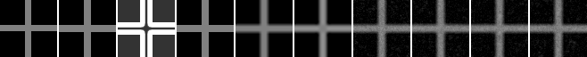
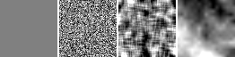
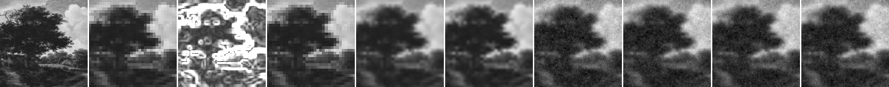
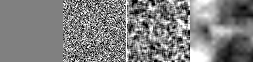

# Structured Texture Pair-Contrast Energy

## Question

structured texture priorを、初期状態への混入やpixel単位のtexture targetではなく、独立した近傍コントラストenergyとして導入すると、crossと自然画像patchの差分・粒状性・境界指標はどう変わるか。

## Hypothesis

texture fieldの符号付き画素値ではなく、隣接点間の絶対コントラストだけを目標統計にすると、#63のpixel target経路より輝度biasを直接誘導しにくい可能性がある。一方、現行Model Dのdata fidelity / pairwise smoothingとの競合が残るため、単純補間baselineを上回るとは仮定しない。

## Setup

- Command: `$env:PYTHONPATH = "src"; .\.venv\Scripts\python.exe experiments/exp_017_texture_contrast_energy.py`
- Date: 2026-06-14
- Experiment seed: 20260614
- Cross decoder seed: 7500
- Natural patch decoder seed: 7501
- Cross: 16x16 guide to 64x64 output
- Natural patch: 32x32 guide to 128x128 output
- Source page: https://commons.wikimedia.org/wiki/File:Landscape.jpg
- License note: Wikimedia Commons marks the faithful reproduction as Public Domain / PD-Art.
- Target mean pair contrast: 0.02
- Model params: `{'j_base': 1.8, 'lambda_data': 6.0, 'gamma': 35.0}`
- Prior configs: `config.json` の `prior_configs`
- Python / dependency version: Python 3.12.13, NumPy 2.3.5

## Baseline

decoder外のbaselineはnearest、bilinear、bicubicとした。decoder条件は`texture_0`、white noise、smoothed noise、fractal value noiseを含む。全decoder条件の初期状態はbilinear guideそのもので、texture fieldは初期状態やpixel targetへ加えていない。

各non-zero priorは、fieldごとの平均隣接コントラストが `0.02` になるようscaleを正規化した。比較する独立項は次の形である。

```text
lambda_texture * (abs(v_i - v_j) - scaled_abs(t_i - t_j))^2
```

## Metrics

### Cross

| Output | MAD | SSIM | Gradient magnitude MAD | Edge leakage | Residual std vs bilinear | Background residual std | Time seconds |
| --- | ---: | ---: | ---: | ---: | ---: | ---: | ---: |
| nearest | 0.013794 | 0.915546 | 0.013946 | 0.128409 | 0.068067 | 0.067518 | 0.000149 |
| bilinear | 0.033143 | 0.901668 | 0.030511 | 0.219728 | 0.000000 | 0.000000 | 0.000179 |
| bicubic | 0.035119 | 0.904375 | 0.030838 | 0.211894 | 0.017207 | 0.008284 | 0.113922 |
| texture_0 | 0.049298 | 0.876092 | 0.046094 | 0.219797 | 0.029314 | 0.027499 | 1.388892 |
| white_contrast | 0.048923 | 0.875974 | 0.044623 | 0.222424 | 0.026983 | 0.025221 | 1.346316 |
| smoothed_contrast | 0.048818 | 0.877278 | 0.044673 | 0.220726 | 0.027295 | 0.024145 | 1.371717 |
| fractal_contrast | 0.049945 | 0.874074 | 0.044711 | 0.222911 | 0.029174 | 0.026368 | 1.335818 |

### Natural Patch

| Output | MAD | SSIM | Gradient magnitude MAD | Strong-edge MAD | Residual std vs bilinear | Flat residual std | Time seconds |
| --- | ---: | ---: | ---: | ---: | ---: | ---: | ---: |
| nearest | 0.045384 | 0.953421 | 0.033359 | 0.089966 | 0.038185 | 0.022211 | 0.000180 |
| bilinear | 0.044369 | 0.959480 | 0.030565 | 0.082830 | 0.000000 | 0.000000 | 0.000372 |
| bicubic | 0.042397 | 0.962820 | 0.029326 | 0.081152 | 0.011087 | 0.008759 | 0.399313 |
| texture_0 | 0.056951 | 0.947044 | 0.034543 | 0.087850 | 0.036462 | 0.039027 | 2.850527 |
| white_contrast | 0.055732 | 0.948439 | 0.033671 | 0.087581 | 0.033838 | 0.035653 | 2.894696 |
| smoothed_contrast | 0.055885 | 0.948093 | 0.033362 | 0.088575 | 0.034027 | 0.036081 | 2.906283 |
| fractal_contrast | 0.055904 | 0.947780 | 0.033449 | 0.088577 | 0.034464 | 0.036018 | 2.913199 |

## Saved Artifacts

- `config.json`
- `metrics.json`
- `notes.md`
- `cross/` と `natural_patch/` のreference、guide、confidence、baseline、各prior output
- 各priorのtexture field、reference差分、bilinear residual、`comparison.png`、`texture_fields.png`

## Images









## Result

Crossのdecoder条件内で最小MADは `smoothed_contrast` の `0.048818` だったが、nearest `0.013794`、bilinear `0.033143`、bicubic `0.035119` より悪かった。`smoothed_contrast` のbackground residual std `0.024145` はdecoder条件内で最小だったが、edge leakage `0.220726` はbilinear `0.219728` よりわずかに大きかった。

Natural patchのdecoder条件内で最小MADは `white_contrast` の `0.055732` だったが、nearest `0.045384`、bilinear `0.044369`、bicubic `0.042397` より悪かった。`white_contrast` はtextureなし条件よりMAD、SSIM、gradient magnitude MAD、flat residual stdが改善したが、bicubicには届かなかった。

#63との差は、texture fieldを初期状態へ混ぜず、`guide + texture` のpixel targetも使わず、近傍コントラストの絶対値だけを独立energy項として評価した点である。各fieldの平均目標コントラストを揃えたため、white / smoothed / fractal間では平均強度より空間配置の違いを比較しやすくした。

## Interpretation

このrunは、structured textureの入れ方をpixel targetからpair-contrast statisticへ切り替えた小規模な切り分けである。non-zero contrast priorがtextureなし条件より一部指標を小さくしたため、独立energy項として作用したことは確認できる。ただしprior間の差は小さく、単純補間に対する改善は確認できなかった。

residual stdは粒状差分の量を示すが、値が大きいことを自然なtextureや意味的ディテールとは解釈しない。今回の自然画像出力では全decoder条件に粒状差分が目視でき、flat residual stdもbicubicより大きかった。MAD / SSIM / gradient / edge指標と合わせて読む。

単純補間を上回らない場合は、structured texture一般の否定ではなく、このpair-contrast energy、重み、目標コントラスト、現行data/pairwise項の組み合わせに対するnegative resultとして扱う。

## Limitations

- crossと1枚の128x128 public-domain自然画像patchだけの比較である。
- texture statisticは隣接絶対コントラスト1種類だけで、方向、周波数帯、長距離相関は扱わない。
- mean pair contrastを揃えても、分布形状と空間相関はpriorごとに異なる。
- Global SSIMはwindowed SSIMではない。
- Python/NumPyの確率的decoderであり、環境非依存のbit-perfect再現性は未確認。
- 意味的ディテール生成、super-resolution、compressionの成立を示す実験ではない。

## Next

- confidence mapとpairwise termの再設計はIssue #67で扱う。
- texture priorを続ける場合は、今回の結果を見て方向性または周波数統計を追加するかを別Issueとして判断する。
