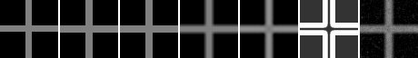
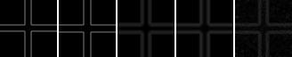
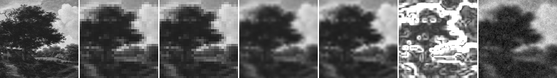
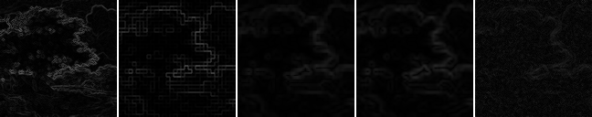

# Model D Perceptual and Gradient Metrics

## Question

MAD / PSNR / global SSIMだけでは区別しにくい境界・勾配変化を、依存追加なしの勾配系指標でどこまで補足できるか。

## Hypothesis

Model Dの粒状変化や境界方向の乱れは、画素差だけでなくraw gradient magnitude、勾配位置相関、強エッジ方向、Laplacian応答の差として現れる。hard edgeのcrossと自然画像patchでは、同じ指標でも解釈が異なる。

## Setup

- Command: `$env:PYTHONPATH = "src"; .\.venv\Scripts\python.exe experiments/exp_016_perceptual_gradient_metrics.py`
- Date: 2026-06-14
- Experiment seed: 20260614
- Cross decoder seed: 7800
- Natural patch decoder seed: 7801
- Cross: 16x16 guide to 64x64 output
- Natural patch: 32x32 guide to 128x128 output
- Model params: `{'j_base': 1.8, 'lambda_data': 6.0, 'gamma': 35.0, 'texture_weight': 0.35}`
- Cross decode config: `{'sweeps': 35, 'temp_start': 0.35, 'temp_end': 0.01, 'proposal_sigma': 0.08}`
- Natural decode config: `{'sweeps': 18, 'temp_start': 0.35, 'temp_end': 0.01, 'proposal_sigma': 0.08}`
- Python / dependency version: Python 3.12.13, NumPy 2.3.5

## Baseline

nearest、bilinear、bicubic upscalingをbaselineとし、現行Model D candidateと比較した。crossはsynthetic high-resolution reference、natural patchはPublic Domain画像cropをGround Truthとして使った。

## Metrics

- `gradient_magnitude_mad`: 画像ごとの最大値正規化を行わず、raw gradient magnitudeの絶対差を平均する。勾配強度の差を見る。
- `gradient_magnitude_correlation`: gradient magnitude mapのPearson相関。勾配の強弱が同じ位置に現れるかを見るが、絶対強度差は単独では表さない。
- `strong_edge_orientation_error_degrees`: referenceの非ゼロ勾配上位25%で、符号を区別しない方向誤差を度数で平均する。
- `laplacian_mad`: 4近傍Laplacian応答の絶対差。細かな振動、ringing、粒状変化にも反応する。
- LPIPSは追加dependencyと学習済み重みを必要とするため、このrunでは使用しない。

### Cross

| Output | MAD | PSNR | SSIM | Gradient magnitude MAD | Gradient correlation | Strong-edge orientation error | Laplacian MAD | Time seconds |
| --- | ---: | ---: | ---: | ---: | ---: | ---: | ---: | ---: |
| nearest | 0.013794 | 21.613 | 0.915546 | 0.013946 | 0.716052 | 12.046 | 0.055664 | 0.000148 |
| bilinear | 0.033143 | 21.495 | 0.901668 | 0.030511 | 0.651549 | 2.081 | 0.064521 | 0.000171 |
| bicubic | 0.035119 | 21.585 | 0.904375 | 0.030838 | 0.676999 | 2.013 | 0.066156 | 0.104804 |
| model_d | 0.048155 | 20.934 | 0.877941 | 0.044586 | 0.605796 | 9.258 | 0.117570 | 1.781274 |

### Natural Patch

| Output | MAD | PSNR | SSIM | Gradient magnitude MAD | Gradient correlation | Strong-edge orientation error | Laplacian MAD | Time seconds |
| --- | ---: | ---: | ---: | ---: | ---: | ---: | ---: | ---: |
| nearest | 0.045384 | 22.578 | 0.953421 | 0.033359 | 0.445819 | 44.658 | 0.106713 | 0.000181 |
| bilinear | 0.044369 | 23.276 | 0.959480 | 0.030565 | 0.605016 | 33.996 | 0.087830 | 0.000369 |
| bicubic | 0.042397 | 23.578 | 0.962820 | 0.029326 | 0.612533 | 33.759 | 0.087473 | 0.404137 |
| model_d | 0.055828 | 22.211 | 0.948301 | 0.033867 | 0.304795 | 39.389 | 0.136666 | 3.855408 |

## Saved Artifacts

- `config.json`
- `metrics.json`
- `notes.md`
- `cross/comparison.png`, `cross/gradient_comparison.png`
- `natural_patch/comparison.png`, `natural_patch/gradient_comparison.png`
- 各caseのreference、guide、baseline、Model D、confidence、gradient map、reference差分PNG

## Images

## Result

crossではnearestのgradient magnitude MADが最小 `0.013946`、gradient correlationが最大 `0.716052` だった。Model Dはgradient magnitude MAD `0.044586`、gradient correlation `0.605796`、Laplacian MAD `0.117570` で、今回のbaselineより勾配強度差と局所高周波差が大きかった。strong-edge orientation errorだけを見るとnearest `12.046` 度に対してModel D `9.258` 度だったが、bilinear `2.081` 度とbicubic `2.013` 度より大きかった。

natural patchではbicubicがgradient magnitude MAD最小 `0.029326`、gradient correlation最大 `0.612533`、orientation error最小 `33.759` 度、Laplacian MAD最小 `0.087473` だった。Model Dはgradient magnitude MAD `0.033867`、gradient correlation `0.304795`、orientation error `39.389` 度、Laplacian MAD `0.136666` だった。

既存の最大値正規化gradient MADとは異なり、今回のgradient magnitude MADは勾配強度の絶対差を保持する。gradient correlationは位置関係、orientation errorは強エッジ方向、Laplacian MADは局所的な高周波差を別々に表す。

## Interpretation

各指標は単独の品質順位ではなく、画素差と構造差のどこでbaselineとModel Dが異なるかを読む補助値として扱う。今回のModel DはMAD / SSIMの悪化と同時にgradient magnitude MAD、gradient correlation、Laplacian MADでもbaselineを上回らなかった。crossのnearestは方向誤差ではModel Dより悪い一方、MADとgradient magnitude MADでは良く、指標間で順位が一致しない例になった。

crossでは境界位置と方向が既知なので方向誤差を直接読みやすい。natural patchではtexture、弱勾配、撮像由来の構造が混在するため、Laplacian MADやgradient correlationの悪化をそのまま知覚品質の悪化と同一視しない。

このrunはModel Dの「真の優位性」、super-resolution、compressionの成立を示すものではない。

## Limitations

- crossと1枚の128x128自然画像patchだけの小規模比較である。
- global SSIMはwindowed SSIMではない。
- gradientとLaplacianは単純な有限差分であり、人間の知覚モデルではない。
- strong-edge thresholdはreferenceの非ゼロ勾配上位25%に固定した。
- LPIPSなど学習済み知覚指標との相関は未確認。
- decode timeはこの環境の小画像runに限る。

## Next

- 複数の自然画像patchへ広げる場合は、ライセンスとcrop手順を固定し、指標間の順位一致・不一致を集計する。
- LPIPSを導入する場合はoptional dependencyとして分離し、モデル重み、version、offline再現性を記録する。
