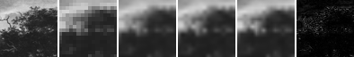
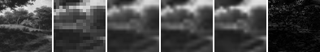
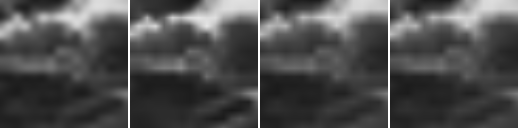

# Model E Bit-Budget INR Comparison

## Question

量子回路由来のModel E座標関数は、同程度の量子化後serialized side bitsを持つclassical implicit residual baselineより、低解像度guideから失われた画像残差を効率よく表現できるか。

## Hypothesis

Model E coupled-state候補は、single-state候補より2次元の交差構造を表現しやすく、Fourier / RFF / small SIREN residual baselineと同程度の保存bit数でMADを下げる可能性がある。ただし、量子回路由来であること自体は採用理由にならず、evaluation splitでclassical baselineに支配される場合はnegative resultとして扱う。

## Setup

- Command: `$env:PYTHONPATH = "src"; .\.venv\Scripts\python.exe experiments/exp_021_model_e_bit_budget.py`
- Date: 2026-06-27
- Experiment seed: 20260627
- Output size: 64x64
- Low guide size: 16x16
- Low guide method: 4x4 block average from 64x64 reference
- Parameter quantization: signed uniform 12-bit values in `[-1, 1]`
- Header bits per parameterized model: 160
- Fit protocol: fixed feature dictionary plus ridge least-squares readout, then quantized readout decode
- Ridge lambda: 0.0001
- Residual clamp during fit: `0.35`
- Python / dependency version: Python 3.12.13, NumPy 2.3.5

## Baseline

画像baselineはnearest、bilinear、bicubic。Parameterized residual baselineはFourier、RFF、small SIREN、Model E single-state、Model E coupled-state。すべて同じlow guide、同じreference、同じfixed-feature + least-squares readout protocolでfitした。

## Result

| Split | Output | Mean serialized side bits | Mean MAD vs GT |
| --- | --- | ---: | ---: |
| development | bicubic | N/A | 0.035619 |
| development | bilinear | N/A | 0.040426 |
| development | fourier_low | 244 | 0.040714 |
| development | fourier_mid | 316 | 0.040906 |
| development | model_e_coupled_low | 736 | 0.041425 |
| development | model_e_coupled_mid | 1276 | 0.041149 |
| development | model_e_single_low | 532 | 0.040457 |
| development | model_e_single_mid | 892 | 0.040777 |
| development | nearest | N/A | 0.037471 |
| development | rff_low | 736 | 0.039374 |
| development | rff_mid | 1312 | 0.035940 |
| development | siren_low | 664 | 0.041350 |
| development | siren_mid | 1168 | 0.040814 |
| evaluation | bicubic | N/A | 0.036953 |
| evaluation | bilinear | N/A | 0.039367 |
| evaluation | fourier_low | 244 | 0.040334 |
| evaluation | fourier_mid | 316 | 0.040186 |
| evaluation | model_e_coupled_low | 736 | 0.040270 |
| evaluation | model_e_coupled_mid | 1276 | 0.039951 |
| evaluation | model_e_single_low | 532 | 0.039588 |
| evaluation | model_e_single_mid | 892 | 0.039439 |
| evaluation | nearest | N/A | 0.039319 |
| evaluation | rff_low | 736 | 0.038499 |
| evaluation | rff_mid | 1312 | 0.034915 |
| evaluation | siren_low | 664 | 0.040484 |
| evaluation | siren_mid | 1168 | 0.040588 |

Evaluation splitで最小MADのparameterized候補は `rff_mid` で、mean MAD `0.034915`、mean serialized side bits `1312` だった。bicubic baselineのevaluation mean MADは `0.036953` だった。

### Extrapolated Output Diagnostic

`eval_natural_br` の同じlow guideと保存parameterを128x128座標へ評価した。これは128x128 Ground Truthとの比較ではなく、周期artifactや局所高周波差を目視・統計確認するための診断である。

| Output | Gradient magnitude mean | Gradient magnitude max | Laplacian abs mean | Min | Max |
| --- | ---: | ---: | ---: | ---: | ---: |
| bicubic | 0.014004 | 0.072061 | 0.003312 | 0.106641 | 0.867690 |
| model_e_coupled_mid | 0.012782 | 0.060562 | 0.002655 | 0.107575 | 0.866089 |
| model_e_single_mid | 0.012722 | 0.060211 | 0.002631 | 0.103973 | 0.858843 |
| rff_mid | 0.014964 | 0.106161 | 0.003749 | 0.089894 | 0.896721 |

## Saved Artifacts

- Config: `config.json`
- Metrics: `metrics.json`
- Notes: `notes.md`
- Case directories: `dev_diagonal/`, `dev_natural_tl/`, `eval_circle/`, `eval_natural_br/`
- Per-case main images: `high_reference.png`, `low_guide.png`, `nearest.png`, `bilinear.png`, `bicubic.png`, best candidate PNG, `comparison.png`, difference maps
- Extrapolated output check: `eval_natural_br/extrapolated_bicubic.png`, `eval_natural_br/extrapolated_rff_mid.png`, `eval_natural_br/extrapolated_model_e_single_mid.png`, `eval_natural_br/extrapolated_model_e_coupled_mid.png`, `eval_natural_br/extrapolated_comparison.png`

## Images

## Interpretation

このrunでは、Model E候補がevaluation splitでclassical INR baselineを一貫して上回るとは解釈しない。特に、fixed-feature + least-squares readout条件では、evaluationの最良parameterized候補とbicubic baselineの差を分けて読む必要がある。

今回の結果は、Model Eの最小候補をSIDF draft specificationへ採用する根拠ではない。一方で、quantized serialized side bits、float-to-quantized delta、fit time、decode timeを同じ形式で保存できたため、次の改善候補を比較する土台にはなる。

## Limitations

- 4ケースだけの小規模runであり、画像集合全体を代表しない。
- Model Eとclassical INRはいずれもfixed feature dictionary + linear readoutに制限した。全parameterを非線形最適化した結果ではない。
- small SIREN baselineは固定sine特徴 + linear readoutであり、通常のmulti-layer SIREN trainingではない。
- serialized bitsはparameter side informationの簡易見積もりであり、complete SIDF bitstream、guide bits、entropy coding、container overheadを含まない。
- extrapolated outputは同じlow guideと保存parameterを128x128座標へ評価した診断であり、128x128 Ground Truthに対する品質測定ではない。
- Global SSIMはwindowed SSIMではない。
- compression、super-resolution、quantum advantageは主張しない。

## Next

- Model Eを継続する場合は、全parameter optimizationまたはModel E特有のfrequency/angle parameterizationを改善し、同じこのprotocolで再比較する。
- classical baseline側は、fixed-feature SIRENではなく小型trainable SIREN/MLPを同じserialized bit accountingで追加する。
- datasetを増やす場合は、開発用と評価用のcrop由来が混ざらないようにsource image単位で分割する。
- Follow-up implementation: [#103](https://github.com/nana-nun/sidf-lab/issues/103)
- Follow-up experiment: [#104](https://github.com/nana-nun/sidf-lab/issues/104)
