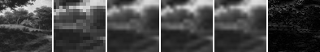
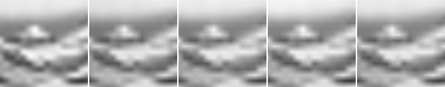

# Model E Trainable INR Source-Split Comparison

## Question

Issue #98 の fixed-feature 制限を外し、source image単位で development / evaluation を分けた小規模datasetで、Model E single/coupled が trainable classical INR baseline より低い量子化後MADを示すか。

## Hypothesis

全parameter fittingにより Model E の固定feature制限は緩和される可能性がある。一方で、同じ serialized side-bit accounting のもとで RFF / SIREN / small MLP が同等または優位なら、現行Model E候補は再設計または不採用候補として扱う。

## Setup

- Command: `$env:PYTHONPATH = "src"; .\.venv\Scripts\python.exe experiments/exp_022_model_e_trainable_inr_source_split.py`
- Date: 2026-06-28
- Experiment seed: 20260628
- Output size: 64x64
- Low guide size: 16x16
- Low guide method: block average from 64x64 reference crop
- Fixture manifest: `experiments/assets/source_split_grayscale/manifest.json`
- Split policy: development/evaluation are separated by source image.
- Fit steps: 48
- Initial step scale: 0.035
- Parameter quantization: signed uniform 12-bit values in `[-1, 1]`
- Python / dependency version: Python 3.12.13, NumPy 2.3.5
- Base dependency: #103 fitting helper. This PR is stacked on #103 until #112 is merged.

## Baseline

画像baselineは nearest、bilinear、bicubic。Parameterized residual candidates は Fourier、RFF、SIREN、small MLP、Model E single-state、Model E coupled-state。全candidateは同じ `fit_inr` interface、同じstep数、同じ量子化規則でfitした。

## Result

| Split | Output | Family | Mean serialized side bits | Mean float MAD | Mean quantized MAD | Mean fit seconds |
| --- | --- | --- | ---: | ---: | ---: | ---: |
| development | bicubic | image | N/A | N/A | 0.046800 | N/A |
| development | bilinear | image | N/A | N/A | 0.048935 | N/A |
| development | fourier_mid | fourier | 348 | 0.048864 | 0.048875 | 0.0561 |
| development | mlp_small | mlp | 708 | 0.048495 | 0.048545 | 0.0302 |
| development | model_e_coupled | model_e_coupled | 780 | 0.048935 | 0.048935 | 0.0734 |
| development | model_e_single | model_e_single | 576 | 0.049300 | 0.049301 | 0.0375 |
| development | nearest | image | N/A | N/A | 0.050186 | N/A |
| development | rff_small | rff | 576 | 0.048502 | 0.050365 | 0.0445 |
| development | siren_small | siren | 696 | 0.049232 | 0.049104 | 0.0328 |
| evaluation | bicubic | image | N/A | N/A | 0.086314 | N/A |
| evaluation | bilinear | image | N/A | N/A | 0.090095 | N/A |
| evaluation | fourier_mid | fourier | 348 | 0.089224 | 0.089244 | 0.0455 |
| evaluation | mlp_small | mlp | 708 | 0.088811 | 0.089009 | 0.0298 |
| evaluation | model_e_coupled | model_e_coupled | 780 | 0.090095 | 0.090095 | 0.0707 |
| evaluation | model_e_single | model_e_single | 576 | 0.090070 | 0.090061 | 0.0361 |
| evaluation | nearest | image | N/A | N/A | 0.089404 | N/A |
| evaluation | rff_small | rff | 576 | 0.088828 | 0.093420 | 0.0453 |
| evaluation | siren_small | siren | 696 | 0.089741 | 0.090546 | 0.0343 |

Evaluation splitで最小MADのparameterized候補は `mlp_small` で、mean quantized MAD `0.089009`、mean serialized side bits `708` だった。

最良classical INR候補は `mlp_small` の mean quantized MAD `0.089009`、最良Model E候補は `model_e_single` の mean quantized MAD `0.090061` だった。

### Extrapolated Output Diagnostic

Evaluation sourceのbottom-right cropで、fit済みparameterを128x128座標へ評価した。これは128x128 Ground Truth品質の測定ではなく、periodic artifactやaliasing傾向を見る診断である。

| Case | Output | Gradient magnitude mean | Gradient magnitude max | Laplacian abs mean | Min | Max |
| --- | --- | ---: | ---: | ---: | ---: | ---: |
| evaluation_hokusai_wave_br | bicubic | 0.022062 | 0.103571 | 0.005347 | 0.221027 | 0.985139 |
| evaluation_hokusai_wave_br | mlp_small | 0.020409 | 0.077647 | 0.004413 | 0.219508 | 0.978335 |
| evaluation_hokusai_wave_br | model_e_coupled | 0.019720 | 0.072832 | 0.004039 | 0.253191 | 0.955938 |
| evaluation_hokusai_wave_br | rff_small | 0.020228 | 0.073932 | 0.004169 | 0.231502 | 0.942592 |
| evaluation_hokusai_wave_br | siren_small | 0.019626 | 0.075348 | 0.004130 | 0.256822 | 0.958120 |

## Saved Artifacts

- Config: `config.json`
- Metrics: `metrics.json`
- Notes: `notes.md`
- Case directories: `development_hobbema_landscape_tl/`, `development_hobbema_landscape_br/`, `evaluation_hokusai_wave_tl/`, `evaluation_hokusai_wave_br/`
- Per-case images: `high_reference.png`, `low_guide.png`, `nearest.png`, `bilinear.png`, `bicubic.png`, `*_quantized.png`, `comparison.png`, difference maps
- Extrapolated diagnostic: `evaluation_hokusai_wave_br/extrapolated_comparison.png`

## Images

## Interpretation

このrunでは、最良Model E候補が最良classical INR候補をevaluation splitで上回るとは解釈しない。結果は small source-split fixture と最小random-search optimizerに限定されるが、fixed-feature制限を外しても現行Model E候補を採用する根拠は得られなかった。

これは量子インスパイアード表現一般の否定ではなく、今回の Model E parameterization、optimizer、dataset、bit accounting 条件での負の結果である。

## Limitations

- Development source 1件、evaluation source 1件からの64x64 crop 2件ずつという小規模datasetであり、一般的な画像集合を代表しない。
- #103のoptimizerはdependency-freeな最小random-searchであり、SIREN/MLP/Model Eの到達可能品質を保証しない。
- `incremental_side_bits` はparameter side informationの簡易見積もりであり、guide bits、container overhead、entropy codingを含む `total_description_bits` ではない。
- extrapolated outputはartifact診断であり、Ground Truth比較ではない。
- compression、super-resolution、quantum advantageは主張しない。

## Next

- 現行Model E候補は、今回の条件では採用しない候補として `docs/model-decision-map.md` または関連docsへ反映する。
- Model Eを再設計する場合は、random-search改善だけでなく、angle/frequency parameterizationそのものを見直す。
- Classical INR baselineについては、より適切なoptimizerを入れる場合も、同じsource-split fixtureとbit accountingで再比較する。
- Follow-up documentation: [#113](https://github.com/nana-nun/sidf-lab/issues/113)
