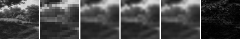
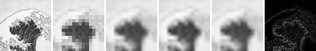
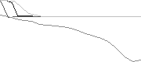
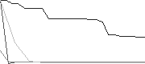

# Model E Fitting Diagnostics

## Question

Issue #104 の負の結果は、現行 Model E single-state / coupled-state の構造限界なのか、最小random-search fitting protocol の不足なのか。

## Hypothesis

Adam系または L-BFGS 相当の勾配利用optimizerで loss curve、gradient norm、parameter update量が改善するなら、#104 の結果にはfitting protocol不足が含まれる可能性がある。一方、objectiveを下げても evaluation split の quantized MAD が classical INR baseline や bicubic baselineを上回らない場合、optimizer不足だけを理由に現行Model E候補を採用することはできない。

## Setup

- Command: `$env:PYTHONPATH = "src"; .\.venv\Scripts\python.exe experiments/exp_023_model_e_fitting_diagnostics.py`
- Date: 2026-06-29
- Experiment seed: 20260629
- Output size: 64x64
- Low guide size: 16x16
- Fixture manifest: `experiments/assets/source_split_grayscale/manifest.json`
- Split policy: development/evaluation are separated by source image.
- Model E candidates: model_e_single, model_e_coupled
- Optimizers: random_search, finite-difference Adam, finite-difference L-BFGS-like
- Initialization candidates: default, small_layers
- Parameter quantization: signed uniform 12-bit values in `[-1, 1]`
- Finite difference epsilon: 0.0001
- Python / dependency version: Python 3.12.13, NumPy 2.3.5

## Baseline

画像baselineは nearest、bilinear、bicubic。Parameterized residual baselineは #104 と同じ RFF、SIREN、small MLP を `fit_inr` の最小random-searchでfitした。Model E single/coupled は random-search、Adam系、L-BFGS相当、small_layers初期化のAdamを比較した。

## Result

| Split | Output | Family | Mean serialized side bits | Mean float MAD | Mean quantized MAD | Mean final loss | Mean final grad norm | Mean fit seconds |
| --- | --- | --- | ---: | ---: | ---: | ---: | ---: | ---: |
| development | bicubic | image | N/A | N/A | 0.046800 | N/A | N/A | N/A |
| development | bilinear | image | N/A | N/A | 0.048935 | N/A | N/A | N/A |
| development | mlp_small | mlp | 708 | 0.049103 | 0.049889 | N/A | N/A | 0.0576 |
| development | model_e_coupled_adam_default | model_e_coupled | 780 | 0.048935 | 0.048935 | 0.005503 | 0.000000 | 3.0505 |
| development | model_e_coupled_adam_small_init | model_e_coupled | 780 | 0.048935 | 0.048935 | 0.005503 | 0.000000 | 3.1892 |
| development | model_e_coupled_lbfgs_like_default | model_e_coupled | 780 | 0.048894 | 0.048890 | 0.005501 | 0.000010 | 1.8045 |
| development | model_e_coupled_random_default | model_e_coupled | 780 | 0.048935 | 0.048935 | 0.005503 | N/A | 0.0783 |
| development | model_e_single_adam_default | model_e_single | 576 | 0.048935 | 0.048935 | 0.005503 | 0.000000 | 0.9492 |
| development | model_e_single_adam_small_init | model_e_single | 576 | 0.048935 | 0.048935 | 0.005503 | 0.000000 | 0.8648 |
| development | model_e_single_lbfgs_like_default | model_e_single | 576 | 0.048959 | 0.048958 | 0.005499 | 0.000112 | 0.5795 |
| development | model_e_single_random_default | model_e_single | 576 | 0.048976 | 0.048977 | 0.005500 | N/A | 0.0360 |
| development | nearest | image | N/A | N/A | 0.050186 | N/A | N/A | N/A |
| development | rff_small | rff | 576 | 0.047854 | 0.056032 | N/A | N/A | 0.0820 |
| development | siren_small | siren | 696 | 0.048822 | 0.049220 | N/A | N/A | 0.0569 |
| evaluation | bicubic | image | N/A | N/A | 0.086314 | N/A | N/A | N/A |
| evaluation | bilinear | image | N/A | N/A | 0.090095 | N/A | N/A | N/A |
| evaluation | mlp_small | mlp | 708 | 0.088542 | 0.088920 | N/A | N/A | 0.0711 |
| evaluation | model_e_coupled_adam_default | model_e_coupled | 780 | 0.090095 | 0.090095 | 0.017708 | 0.000000 | 3.0313 |
| evaluation | model_e_coupled_adam_small_init | model_e_coupled | 780 | 0.090095 | 0.090095 | 0.017708 | 0.000000 | 3.1102 |
| evaluation | model_e_coupled_lbfgs_like_default | model_e_coupled | 780 | 0.089347 | 0.089336 | 0.017678 | 0.000064 | 1.8933 |
| evaluation | model_e_coupled_random_default | model_e_coupled | 780 | 0.093717 | 0.093733 | 0.018271 | N/A | 0.0724 |
| evaluation | model_e_single_adam_default | model_e_single | 576 | 0.090095 | 0.090095 | 0.017708 | 0.000000 | 1.1755 |
| evaluation | model_e_single_adam_small_init | model_e_single | 576 | 0.090584 | 0.090390 | 0.017196 | 0.001487 | 1.0890 |
| evaluation | model_e_single_lbfgs_like_default | model_e_single | 576 | 0.090095 | 0.090095 | 0.017708 | 0.000000 | 0.6296 |
| evaluation | model_e_single_random_default | model_e_single | 576 | 0.090095 | 0.090095 | 0.017708 | N/A | 0.0458 |
| evaluation | nearest | image | N/A | N/A | 0.089404 | N/A | N/A | N/A |
| evaluation | rff_small | rff | 576 | 0.088313 | 0.091068 | N/A | N/A | 0.0622 |
| evaluation | siren_small | siren | 696 | 0.090093 | 0.091027 | N/A | N/A | 0.0658 |

Evaluation splitの最良classical parameterized baselineは `mlp_small` で、mean quantized MAD `0.088920` だった。最良Model E diagnostic conditionは `model_e_coupled_lbfgs_like_default` で、mean quantized MAD `0.089336` だった。

## Saved Artifacts

- Config: `config.json`
- Metrics: `metrics.json`
- Notes: `notes.md`
- Case directories: `development_hobbema_landscape_tl/`, `development_hobbema_landscape_br/`, `evaluation_hokusai_wave_tl/`, `evaluation_hokusai_wave_br/`
- Per-case images: `high_reference.png`, `low_guide.png`, `nearest.png`, `bilinear.png`, `bicubic.png`, `best_model_e_quantized.png`, `comparison.png`, `diff_best_model_e_vs_gt.png`
- Per-case traces: `*_trace.csv`
- Per-case curve images: `model_e_single_loss_curves.png`, `model_e_coupled_loss_curves.png`

## Images

## Interpretation

このrunは、現行Model Eのoptimizer診断であり、Model E一般の採否や画像品質の一般結論ではない。finite-difference Adam / L-BFGS-like の結果でlossやgradient normが変化しても、それだけではcompression、super-resolution、quantum advantage、またはSIDF仕様採用の根拠にはならない。

評価では、optimizer不足と構造不足を混同しない。もしModel E条件が #104 のrandom-search条件より改善していても、classical INR baselineやbicubic baselineとの関係、量子化後MAD、serialized side bitsを分けて読む必要がある。

## Limitations

- Development source 1件、evaluation source 1件からの64x64 crop 2件ずつという小規模datasetであり、一般的な画像集合を代表しない。
- Adam / L-BFGS-like は依存追加を避けた有限差分診断であり、本格的なautograd optimizerや厳密なL-BFGS実装ではない。
- 有限差分は計算量を抑えるためforward differenceを使っており、gradient normは診断値である。
- `incremental_side_bits` はparameter side informationの簡易見積もりであり、guide bits、container overhead、entropy codingを含む `total_description_bits` ではない。
- compression、super-resolution、quantum advantageは主張しない。

## Next

- Model E parameterization候補の比較は #122 で扱う。
- より本格的なoptimizer比較を続ける場合は、autograd依存の導入可否と、classical baselineにも同じoptimizerを適用する方針を別Issueで決める。
