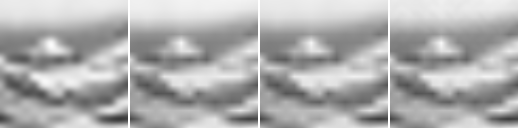

# Model E Parameterization Redesign Source-Split Comparison

## Question

Issue #116 で整理し、Issue #121 で実装した Model E Candidate A / B / C は、#104 と同じ source-split fixture、baseline、12-bit quantization、incremental side-bit accounting の条件で、現行 Model E single/coupled より続ける価値を示すか。

## Hypothesis

Candidate A の fixed frequency ladder、Candidate B の compact frequency table、Candidate C の coordinate frequency + guide modulation は、現行Model Eで混ざっていた frequency placement と guide modulation を分けるため、現行 Model E より低い量子化後MADを示す可能性がある。一方、同じ条件で classical INR baseline や bicubic baselineを上回らない場合、このrunだけで採用候補とは扱わない。

## Setup

- Command: `$env:PYTHONPATH = "src"; .\.venv\Scripts\python.exe experiments/exp_024_model_e_parameterization_redesign.py`
- Date: 2026-06-29
- Experiment seed: 20260629
- Output size: 64x64
- Low guide size: 16x16
- Low guide method: block average from 64x64 reference crop
- Fixture manifest: `experiments/assets/source_split_grayscale/manifest.json`
- Split policy: development/evaluation are separated by source image.
- Fit steps: 48
- Initial step scale: 0.035
- Parameter quantization: signed uniform 12-bit values in `[-1, 1]`
- Python / dependency version: Python 3.12.13, NumPy 2.3.5

## Baseline

画像baselineは nearest、bilinear、bicubic。Classical parameterized baseline は Fourier、RFF、SIREN、small MLP。現行Model Eは single-state / coupled-state。新候補は Candidate A `model_e_ladder`、Candidate B `model_e_frequency_table`、Candidate C `model_e_modulated`。全candidateは同じ `fit_inr` interface、同じrandom-search step数、同じ12-bit量子化規則でfitした。

## Result

| Split | Output | Group | Family | Mean serialized side bits | Mean float MAD | Mean quantized MAD | Mean quantized-float MAD delta | Mean clipped ratio | Mean fit seconds |
| --- | --- | --- | --- | ---: | ---: | ---: | ---: | ---: | ---: |
| development | bicubic | image | image | N/A | N/A | 0.046800 | N/A | N/A | N/A |
| development | bilinear | image | image | N/A | N/A | 0.048935 | N/A | N/A | N/A |
| development | candidate_a_ladder | candidate | model_e_ladder | 636 | 0.048936 | 0.048936 | -0.000000 | 0.0000 | 0.0679 |
| development | candidate_b_frequency_table | candidate | model_e_frequency_table | 708 | 0.048935 | 0.048935 | 0.000000 | 0.2326 | 0.0534 |
| development | candidate_c_modulated | candidate | model_e_modulated | 636 | 0.048893 | 0.048884 | -0.000009 | 0.1892 | 0.0727 |
| development | fourier_mid | classical | fourier | 348 | 0.048864 | 0.048875 | 0.000010 | 0.0000 | 0.0570 |
| development | mlp_small | classical | mlp | 708 | 0.047711 | 0.054767 | 0.007056 | 0.1512 | 0.0313 |
| development | model_e_coupled | current_model_e | model_e_coupled | 780 | 0.048908 | 0.048905 | -0.000003 | 0.0102 | 0.0727 |
| development | model_e_single | current_model_e | model_e_single | 576 | 0.048924 | 0.048939 | 0.000015 | 0.0781 | 0.0372 |
| development | nearest | image | image | N/A | N/A | 0.050186 | N/A | N/A | N/A |
| development | rff_small | classical | rff | 576 | 0.048179 | 0.059257 | 0.011078 | 0.4375 | 0.0468 |
| development | siren_small | classical | siren | 696 | 0.048876 | 0.049955 | 0.001079 | 0.3690 | 0.0310 |
| evaluation | bicubic | image | image | N/A | N/A | 0.086314 | N/A | N/A | N/A |
| evaluation | bilinear | image | image | N/A | N/A | 0.090095 | N/A | N/A | N/A |
| evaluation | candidate_a_ladder | candidate | model_e_ladder | 636 | 0.089876 | 0.089839 | -0.000037 | 0.0135 | 0.0686 |
| evaluation | candidate_b_frequency_table | candidate | model_e_frequency_table | 708 | 0.090026 | 0.090594 | 0.000568 | 0.2326 | 0.0533 |
| evaluation | candidate_c_modulated | candidate | model_e_modulated | 636 | 0.089733 | 0.089848 | 0.000115 | 0.1892 | 0.0697 |
| evaluation | fourier_mid | classical | fourier | 348 | 0.089224 | 0.089244 | 0.000020 | 0.0000 | 0.0483 |
| evaluation | mlp_small | classical | mlp | 708 | 0.089067 | 0.089694 | 0.000627 | 0.1860 | 0.0306 |
| evaluation | model_e_coupled | current_model_e | model_e_coupled | 780 | 0.090095 | 0.090095 | 0.000000 | 0.0102 | 0.0698 |
| evaluation | model_e_single | current_model_e | model_e_single | 576 | 0.090263 | 0.090259 | -0.000004 | 0.0469 | 0.0373 |
| evaluation | nearest | image | image | N/A | N/A | 0.089404 | N/A | N/A | N/A |
| evaluation | rff_small | classical | rff | 576 | 0.088676 | 0.097425 | 0.008749 | 0.4844 | 0.0438 |
| evaluation | siren_small | classical | siren | 696 | 0.090285 | 0.091440 | 0.001155 | 0.3571 | 0.0324 |

Evaluation splitの最良classical INR候補は `fourier_mid` で、mean quantized MAD `0.089244`、mean serialized side bits `348` だった。

Evaluation splitの最良current Model E候補は `model_e_coupled` で、mean quantized MAD `0.090095`、mean serialized side bits `780` だった。

Evaluation splitの最良new candidateは `candidate_a_ladder` で、mean quantized MAD `0.089839`、mean serialized side bits `636` だった。

### Evaluation Side-Bit Groups

| Output | Family | Mean serialized side bits | Parameter group bits |
| --- | --- | ---: | --- |
| candidate_a_ladder | model_e_ladder | 636 | phase=24, readout=24, residual_scale=12, scale=384 |
| candidate_b_frequency_table | model_e_frequency_table | 708 | frequencies=240, mixing=192, phase=48, readout=24, residual_scale=12 |
| candidate_c_modulated | model_e_modulated | 636 | coord_frequency=288, gate=48, phase=72, readout=24, residual_scale=12 |
| fourier_mid | fourier | 348 | readout=156 |
| mlp_small | mlp | 708 | bias=72, output_bias=12, readout=72, weights=360 |
| model_e_coupled | model_e_coupled | 780 | layers=540, readout=36, residual_scale=12 |
| model_e_single | model_e_single | 576 | layers=360, readout=12, residual_scale=12 |
| rff_small | rff | 576 | bias=48, readout=96, weights=240 |
| siren_small | siren | 696 | bias=72, readout=72, weights=360 |

### Extrapolated Output Diagnostic

Evaluation sourceのbottom-right cropで、fit済みparameterを128x128座標へ評価した。これは128x128 Ground Truth品質の測定ではなく、periodic artifactやaliasing傾向を見る診断である。

| Case | Output | Gradient magnitude mean | Gradient magnitude max | Laplacian abs mean | Min | Max |
| --- | --- | ---: | ---: | ---: | ---: | ---: |
| evaluation_hokusai_wave_br | bicubic | 0.022062 | 0.103571 | 0.005347 | 0.221027 | 0.985139 |
| evaluation_hokusai_wave_br | candidate_a_ladder | 0.019986 | 0.075036 | 0.004793 | 0.250873 | 0.968625 |
| evaluation_hokusai_wave_br | fourier_mid | 0.019863 | 0.074046 | 0.004071 | 0.269978 | 0.957680 |
| evaluation_hokusai_wave_br | model_e_single | 0.019720 | 0.072832 | 0.004039 | 0.253191 | 0.955938 |

## Saved Artifacts

- Config: `config.json`
- Metrics: `metrics.json`
- Notes: `notes.md`
- Case directories: `development_hobbema_landscape_tl/`, `development_hobbema_landscape_br/`, `evaluation_hokusai_wave_tl/`, `evaluation_hokusai_wave_br/`
- Per-case images: `high_reference.png`, `low_guide.png`, `nearest.png`, `bilinear.png`, `bicubic.png`, `*_float.png`, `*_quantized.png`, `diff_*_vs_gt.png`, `comparison.png`
- Extrapolated diagnostic: `evaluation_hokusai_wave_br/extrapolated_comparison.png`

## Images

## Interpretation

このrunは、Model E parameterization候補の小規模比較であり、Model E一般の採否や画像品質の一般結論ではない。評価では、float結果、12-bit量子化後結果、serialized side bits、clipping ratioを分けて読む。

新candidateが現行Model Eより改善しても、classical INR baselineやbicubic baselineとの関係を見ずに採用根拠とはしない。逆に、この小規模runで改善しない場合も、autograd optimizer、別bit depth、別candidate設計、より広いdatasetの否定ではない。

今回のevaluation splitでは、最良new candidateの `candidate_a_ladder` は最良current Model Eの `model_e_coupled` より量子化後MADを下げた。一方で、最良classical INRの `fourier_mid`、nearest baseline、bicubic baselineを上回らなかった。そのため、Candidate A/B/Cのcompact設定は「現行Model Eよりは一部改善したが、採用候補へ戻す根拠には不足」と扱う。

## Limitations

- Development source 1件、evaluation source 1件からの64x64 crop 2件ずつという小規模datasetであり、一般的な画像集合を代表しない。
- optimizerは #104 と同じ dependency-free random search であり、各parameterizationの到達可能品質を保証しない。
- Candidate A/B/Cは compact な最小設定であり、周波数数、depth、states、parameter group別quantizationは未探索である。
- `incremental_side_bits` はparameter side informationの簡易見積もりであり、guide bits、container overhead、entropy codingを含む `total_description_bits` ではない。
- extrapolated outputはartifact診断であり、Ground Truth比較ではない。
- compression、super-resolution、quantum advantageは主張しない。

## Next

- この結果を `docs/model-decision-map.md` と `docs/research-state.md` に反映する。
- Candidate A/C の改善がcompact設定とrandom-search条件に限定されるかを調べる場合は、candidate size、bit-depth耐性、optimizer依存を別Issueへ分ける。
