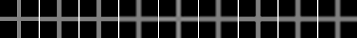
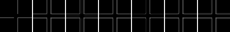
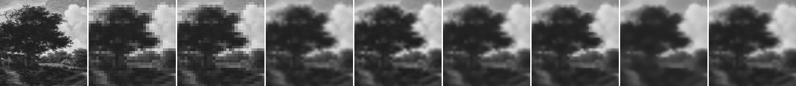
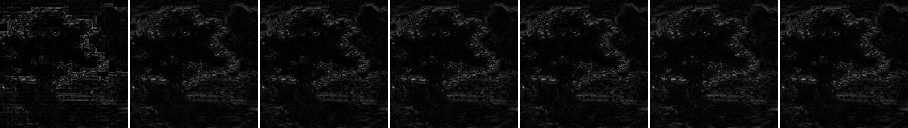

# Model D Non-local Patch Graph と Self-guided NLM Baseline の比較

## Question

low-guide-only 条件で、bilinear-upscaled low guide から作る self-guided Non-local Means baseline と non-local patch graph decoder 候補は、nearest / bilinear / bicubic および既存の low-guide-only guided filter / joint bilateral baseline と比べて、cross / circle / 自然画像patchの reference metrics を改善するか。

## Hypothesis

low guide に残った繰り返し構造や自己類似性は、局所4近傍平滑化より有用な拘束になる可能性がある。ただし、self-guided NLM も patch graph も high-resolution guidance や Ground Truth を使わないため、低解像度guideで失われた高周波構造を復元するとは仮定しない。#87 / #88 の負の結果を踏まえ、有限温度Metropolisとwhite-noise textureは使わず、決定論的Jacobi solverで解く。

## Setup

- Command: `$env:PYTHONPATH = "src"; .\.venv\Scripts\python.exe experiments/exp_028_model_d_nonlocal_patch_graph.py`
- Date: 2026-08-22
- Experiment seed: 20260822 (NLM と patch graph は決定論的で乱数を使わない)
- Cross: 16x16 guide to 64x64 output
- Circle: 16x16 guide to 64x64 output
- Natural patch: 32x32 guide to 128x128 output
- Natural patch source asset: `experiments/assets/landscape_pd_128.npy`
- Guidance policy: No independent high-resolution guidance; all patch similarity derives from the low guide only. Ground Truth is used only for metrics.
- NLM config: `{'description': 'self-guided Non-local Means over the bilinear-upscaled low guide', 'patch_radius': 1, 'search_radius': 5, 'h': 0.08, 'high_resolution_guidance': False}`
- Patch graph config: `{'description': 'non-local patch graph decoder on the bilinear-upscaled low guide', 'lambda_data': 6.0, 'j_base': 1.8, 'gamma': 35.0, 'j_nonlocal': 1.0, 'patch_radius': 1, 'search_radius': 7, 'num_neighbors': 5, 'local_exclude_radius': 1, 'h': 0.08, 'max_sweeps': 80, 'tol': 1e-06, 'high_resolution_guidance': False}`
- Guided filter config: `{'description': 'self-guided filter on the bilinear-upscaled low guide', 'radius': 3, 'epsilon': 0.0001, 'high_resolution_guidance': False}`
- Joint bilateral config: `{'description': 'nearest-upscaled values refined with the bilinear-upscaled low guide', 'radius': 3, 'sigma_spatial': 2.0, 'sigma_range': 0.08, 'high_resolution_guidance': False}`
- Python / dependency version: Python 3.12.13, NumPy 2.3.5

## Baseline

補間baselineは nearest / bilinear / bicubic。既存 low-guide-only edge-aware baseline として guided filter と joint bilateral を含める。いずれも独立した高解像度guidanceを使わず、guidance は bilinear-upscaled low guide から作る。metrics の reference は synthetic shape の高解像度生成、または自然画像cropの128x128 grayscaleであり、Ground Truth は metrics 計算にのみ使う。

## What changed from #87 / #88

- Objective: 局所4近傍のquadratic pairwiseだけでなく、low-guide由来 patch descriptor で選んだ非局所edgeを加えた。
- Update: 有限温度Metropolis (#87) や Gaussian proposal greedy / ICM (#88) ではなく、決定論的Jacobi sweepでquadratic objectiveを解く。
- Texture: white-noise texture term (#37) は使わない。
- Confidence: gradient-based confidence map (#56/#61/#67) は使わず、data fidelity と patch-similarity 重みのみで構成した。
- Patch matching は bilinear-upscaled low guide からのみ計算し、Ground Truth や高解像度guidanceは使わない。

## Metrics

### Cross (64x64)

| Output | MAD vs reference | PSNR | SSIM | Gradient MAD | Edge leakage | Time seconds |
| --- | ---: | ---: | ---: | ---: | ---: | ---: |
| nearest | 0.013794 | 21.613 | 0.915546 | 0.039444 | 0.128409 | 0.000121 |
| bilinear | 0.033143 | 21.495 | 0.901668 | 0.142559 | 0.219728 | 0.000151 |
| bicubic | 0.035119 | 21.585 | 0.904375 | 0.129688 | 0.211894 | 0.090614 |
| guided_filter | 0.033334 | 21.495 | 0.901557 | 0.142162 | 0.219701 | 0.000676 |
| joint_bilateral | 0.019354 | 22.602 | 0.928353 | 0.068129 | 0.155588 | 0.001168 |
| self_guided_nlm | 0.032664 | 21.547 | 0.902851 | 0.126594 | 0.217751 | 0.009372 |
| nonlocal_patch_graph | 0.035466 | 21.422 | 0.899010 | 0.151039 | 0.221005 | 0.043447 |

### Circle (64x64)

| Output | MAD vs reference | PSNR | SSIM | Gradient MAD | Edge leakage | Time seconds |
| --- | ---: | ---: | ---: | ---: | ---: | ---: |
| nearest | 0.016602 | 20.809 | 0.895906 | 0.049915 | 0.308511 | 0.000047 |
| bilinear | 0.018426 | 23.880 | 0.943239 | 0.075561 | 0.257828 | 0.000107 |
| bicubic | 0.018965 | 23.667 | 0.940561 | 0.071086 | 0.265194 | 0.092730 |
| guided_filter | 0.018512 | 23.896 | 0.943389 | 0.075213 | 0.257651 | 0.000532 |
| joint_bilateral | 0.016075 | 22.806 | 0.929862 | 0.058489 | 0.295457 | 0.001180 |
| self_guided_nlm | 0.017667 | 24.097 | 0.946018 | 0.071245 | 0.256996 | 0.010365 |
| nonlocal_patch_graph | 0.019576 | 23.903 | 0.943138 | 0.080497 | 0.256104 | 0.036411 |

### Natural Patch (128x128)

| Output | MAD vs GT | PSNR | SSIM | Gradient MAD | Strong-edge MAD | Time seconds |
| --- | ---: | ---: | ---: | ---: | ---: | ---: |
| nearest | 0.045384 | 22.578 | 0.953421 | 0.092455 | 0.089966 | 0.000190 |
| bilinear | 0.044369 | 23.276 | 0.959480 | 0.094319 | 0.082830 | 0.000360 |
| bicubic | 0.042397 | 23.578 | 0.962820 | 0.090419 | 0.081152 | 0.365278 |
| guided_filter | 0.044755 | 23.248 | 0.959171 | 0.092427 | 0.082989 | 0.001432 |
| joint_bilateral | 0.043522 | 23.396 | 0.960646 | 0.073171 | 0.081718 | 0.004784 |
| self_guided_nlm | 0.047628 | 22.902 | 0.955596 | 0.088825 | 0.085362 | 0.051886 |
| nonlocal_patch_graph | 0.045336 | 23.142 | 0.958037 | 0.096189 | 0.083744 | 0.190700 |

### Non-local Patch Graph Statistics

| Case | Mean non-local degree | Mean patch distance | Median patch distance | Non-local edges | Solver sweeps | Final objective |
| --- | ---: | ---: | ---: | ---: | ---: | ---: |
| cross | 9.837 | 0.000052 | 0.000000 | 20147 | 26 | 13.0769 |
| circle | 9.984 | 0.000102 | 0.000000 | 20448 | 24 | 7.5673 |
| natural_patch | 9.855 | 0.000173 | 0.000047 | 80735 | 26 | 25.1160 |

## Saved Artifacts

- Config: `config.json`
- Metrics and graph statistics: `metrics.json`
- Notes: `notes.md`
- Per-case artifacts: `cross/`, `circle/`, `natural_patch/`
- 各caseに reference、low guide、全出力、reference差分、comparison / difference_comparison PNGを保存した。

## Images

## Result

MADが最小だった出力は、crossで `nearest`、circleで `joint_bilateral`、natural patchで `bicubic` だった。

候補と補間baselineの比較:

- Cross: `self_guided_nlm` の mad_vs_reference `0.032664` は、補間baseline最小の `nearest` `0.013794` を上回った（悪化）または同等。 `nonlocal_patch_graph` の mad_vs_reference `0.035466` は、補間baseline最小の `nearest` `0.013794` を上回った（悪化）または同等。
- Circle: `self_guided_nlm` の mad_vs_reference `0.017667` は、補間baseline最小の `nearest` `0.016602` を上回った（悪化）または同等。 `nonlocal_patch_graph` の mad_vs_reference `0.019576` は、補間baseline最小の `nearest` `0.016602` を上回った（悪化）または同等。
- Natural patch: `self_guided_nlm` の mad_vs_gt `0.047628` は、補間baseline最小の `bicubic` `0.042397` を上回った（悪化）または同等。 `nonlocal_patch_graph` の mad_vs_gt `0.045336` は、補間baseline最小の `bicubic` `0.042397` を上回った（悪化）または同等。

## Interpretation

この結果は、low-guide-only 条件で非局所自己類似性を追加した2候補の最小比較である。MADの最小値が補間baselineのままの場合、現在のparameterでは patch graph / NLM が single-pass補間より総合的に優れるとは言えない。改善が見られた指標がある場合も、cross / circle / 1枚のnatural patch という限定条件での初期測定であり、super-resolution / compression / 既存形式への優位性を示すものではない。

non-local patch graph は決定論的Jacobi solverでobjectiveを下げるが、#88 と同様に、objective低下と reference metrics 改善は別の評価軸として扱う。patch descriptor を bilinear-upscaled low guide から作るため、選ばれる非局所neighborが補間結果の滑らかさを再表現しているだけの可能性がある点にも注意する。

## Limitations

- cross / circle の synthetic shape と、1枚のpublic-domain自然画像patchだけの比較である。
- patch matching は bilinear-upscaled low guide からのみ計算しており、独立した高解像度guidanceやGround Truthは使っていない。したがって high-resolution guidance を使う手法の性能は測っていない。
- NLM と patch graph のparameter（patch radius、search radius、neighbor数、h、重み）は小規模な固定値で、網羅的探索はしていない。
- solver は決定論的Jacobiで、bit-perfect cross-environment再現性は未確認である。
- Global SSIM は依存なしの全画像SSIMであり、windowed SSIMではない。
- decode time はこの環境の小画像runに限る。
- この結果はsuper-resolutionやcompressionの成立を示さない。

## Next

- 改善が限定的な場合は、patch descriptor を bilinear ではなく別のlow-guide由来表現（例: nearest-upscaled guide や low-resolution guide 空間でのpatch matching）から作る条件を分けて比較する。
- high-resolution guidance を使う joint upsampling 条件は、low-guide-only 条件と明確に分けた別Issueで測る。
- patch graph の objective 低下と reference metrics の乖離が大きい場合は、quadratic penalty ではなく robust penalty や residual target 候補を別Issueで比較する。
